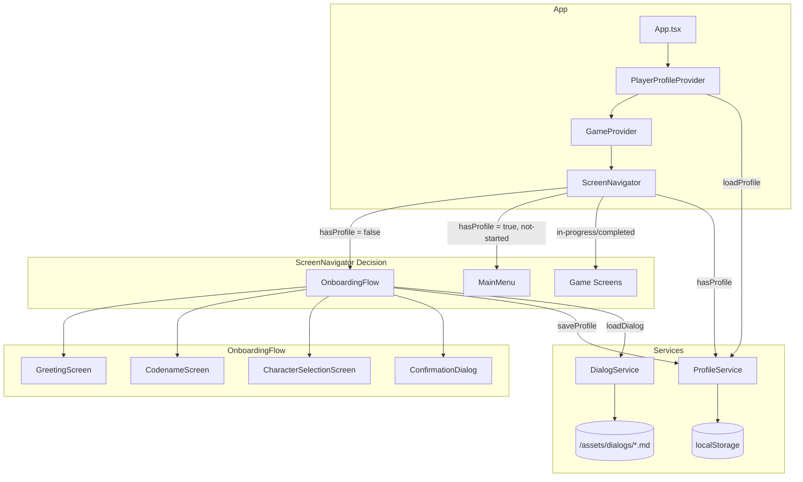

# Design Document: Agent Onboarding

## Overview

Das Agent-Onboarding ist ein vierstufiger Einführungsflow, der neue Spieler durch die Erstellung ihres Agentenprofils führt (Begrüßung → Deckname → Charakterauswahl → Bestätigungsdialog). Der Flow wird in den bestehenden `ScreenNavigator` integriert und erscheint vor dem MainMenu, wenn noch kein gültiges `PlayerProfile` in localStorage existiert.

Die Architektur folgt dem bestehenden Feature-Modul-Pattern: Ein neuer Ordner `src/features/onboarding/` kapselt alle Onboarding-Komponenten. Der Zustand des mehrstufigen Flows wird lokal im OnboardingFlow-Container verwaltet (kein GameContext-Dispatch für Step-Transitions). Ein neuer `ProfileService` in `src/services/profile-service.ts` übernimmt die Persistenz, ein `DialogService` in `src/services/dialog-service.ts` lädt mehrseitige Dialog-Texte aus externen Markdown-Dateien, und ein `PlayerProfileProvider`-Context stellt das Profil im gesamten App-Baum bereit.

Director Nova verfügt über ein Pose-System mit vier Varianten (neutral, freundlich, lobend, skeptisch) zur Verwendung in verschiedenen Dialogkontexten. Der Begrüßungsbildschirm verwendet die `neutral`-Pose und zeigt einen mehrseitigen Dialog mit Typewriter-Effekt, dessen Inhalt zur Laufzeit aus einer externen Markdown-Datei geladen wird.

Der Typewriter-Effekt rendert Text zeichenweise mit konfigurierbarer Geschwindigkeit und spielt während der Animation einen Tipp-Sound (`typing.mp3`). Der "Weiter"-Button ist disabled, bis die Animation abgeschlossen ist.

Die Charakterauswahl verwendet ein eigenes Hintergrundbild (`Background_character.png`) und benutzerdefinierte Pfeilbilder für die Carousel-Navigation anstelle von Icon-Bibliotheken.

Nach der Charakterauswahl wird ein Bestätigungsdialog ("Bist du dir sicher?") angezeigt, bevor das Profil gespeichert und die Mission gestartet wird.

### Design-Entscheidungen

| Entscheidung | Begründung |
|---|---|
| Lokaler Step-State statt GameReducer | Onboarding-Steps sind ephemeral und brauchen keine globale Sichtbarkeit. Vermeidet Verschmutzung des GameAction-Union-Types. |
| Separater ProfileService (nicht persistence-service) | Trennung der Verantwortung: PlayerProgress ≠ PlayerProfile. Unabhängige Erweiterbarkeit. |
| localStorage-Check im ScreenNavigator | Einfachste Integration ohne neue MissionStatus-Werte. Rückwärtskompatibel. |
| PlayerProfileProvider als eigener Context | Profile-Daten sind orthogonal zum GameState. Vermeidet unnötige Re-Renders bei Spielzustandsänderungen. |
| Validierung im ProfileService | Single Source of Truth für Validierungsregeln. Wiederverwendbar in Komponenten und beim Laden. |
| Dialog-Texte aus externen Markdown-Dateien | Inhalte können ohne Code-Änderungen angepasst werden. Trennung von Content und Logik. |
| Director Nova Pose-System analog zu Charakter-System | Konsistenter Ansatz für alle NPC-Bilder. Einfach erweiterbar für zukünftige Dialoge/Szenen. |
| fetch() statt statischem Import für Dialoge | Ermöglicht Content-Updates ohne Rebuild. Dialogdateien bleiben im public-Ordner editierbar. |
| Typewriter-Effekt als eigene Utility/Komponente | Wiederverwendbar für zukünftige Dialogszenen. Kapselt Animation + Audio-Logik. |
| Benutzerdefinierte Pfeilbilder statt Icon-Library | Konsistenter visueller Stil mit dem restlichen Spieldesign. Assets vom Designer bereitgestellt. |
| Bestätigungsdialog als eigener Step | Verhindert versehentliches Speichern. Erlaubt Rückkehr zur Charakterauswahl. |
| Neutral-Pose für Begrüßung | Neutrale Pose passt besser zum ersten Kontakt – die Chefin ist noch reserviert. |

---

## Architecture



### Datenfluss

1. **App-Start**: `PlayerProfileProvider` ruft `loadProfile()` auf → setzt Context-State
2. **ScreenNavigator**: Prüft `hasProfile()` → entscheidet zwischen Onboarding und MainMenu
3. **Onboarding**: Sammelt Daten über 4 Steps → ruft `saveProfile()` auf → aktualisiert Context
4. **Nach Onboarding**: ScreenNavigator rendert MainMenu, Spieler klickt "Neues Spiel" → START_MISSION

### Audio-Fluss

- Die Hauptmenü-Musik (`mainmenu.mp3`) läuft während des gesamten Onboardings weiter – das Onboarding startet/stoppt sie nicht.
- Der Typewriter-Sound (`typing.mp3`) wird lokal im GreetingScreen über ein HTML Audio-Element gesteuert.
- Hover/Click-Sounds werden über das bestehende app-weite Sound-System abgespielt (keine Änderung im Onboarding nötig).

---

## Components and Interfaces

### Komponentenhierarchie

```
src/features/onboarding/
├── index.ts                        # Re-exports
├── OnboardingFlow.tsx              # Container mit Step-State (4 Steps)
├── GreetingScreen.tsx              # Step 1: Begrüßung mit Typewriter-Dialog
├── CodenameScreen.tsx              # Step 2: Deckname-Eingabe
├── CharacterSelectionScreen.tsx    # Step 3: Charakterauswahl (eigener Background)
├── ConfirmationDialog.tsx          # Step 4: Bestätigungsdialog
├── CharacterCarousel.tsx           # Carousel-Unterkomponente (Custom-Pfeile)
├── TypewriterText.tsx              # Typewriter-Effekt-Komponente
├── characters.ts                   # Charakter-Datensatz (4 Agenten)
└── director.ts                     # Director Nova Pose-System
```

### OnboardingFlow (Container)

```typescript
interface OnboardingFlowProps {
  onComplete: () => void; // Callback wenn Onboarding abgeschlossen
}

type OnboardingStep = 'greeting' | 'codename' | 'character-selection' | 'confirmation';

// Interner State
interface OnboardingState {
  currentStep: OnboardingStep;
  codename: string;                        // Gesammelter Deckname
  selectedCharacter: AgentCharacterId | null; // Gewählter Charakter (vor Bestätigung)
}
```

Verantwortlichkeiten:
- Verwaltet aktuellen Step und gesammelte Daten
- Rendert den aktuellen Step-Screen
- Speichert `selectedCharacter` nach CharacterSelectionScreen → ConfirmationDialog
- Ruft nach Bestätigung im ConfirmationDialog `saveProfile()` und `onComplete()` auf
- Zeigt Fehlermeldung bei fehlgeschlagener Persistenz im ConfirmationDialog

### GreetingScreen

```typescript
interface GreetingScreenProps {
  onContinue: () => void;
}

// Interner State
interface GreetingScreenState {
  paragraphs: string[];           // Aus intro.md geladene Absätze
  currentParagraphIndex: number;  // Aktuell angezeigter Absatz
  isLoading: boolean;             // Dialog wird geladen
  loadError: boolean;             // Fehler beim Laden
  // Typewriter-State
  isTyping: boolean;              // Typewriter-Animation läuft gerade
  displayedText: string;          // Aktuell sichtbarer Text (zeichenweise aufgebaut)
  currentCharIndex: number;       // Aktueller Zeichenindex im aktuellen Absatz
}
```

Verhalten:
- Fullscreen-Hintergrundbild (Background.png aus `/assets/images/Intro/Background.png`)
- Director Nova-Bild links (max 40% Breite), Pose: `neutral` (`/assets/images/Direktor Nova/Geheimdienstchefin-neutral.png`)
- Dialog-Text wird bei Mount aus `public/assets/dialogs/intro.md` via `loadDialog()` geladen
- Inhalt wird an Leerzeilen in Absätze aufgeteilt → `paragraphs[]`
- **Typewriter-Effekt**: Jeder Absatz wird zeichenweise gerendert via `TypewriterText`-Komponente
  - Während der Animation: `typing.mp3` spielt, "Weiter"-Button ist disabled
  - Nach Abschluss: Sound stoppt, Button wird enabled
- "Weiter"-Button:
  - Disabled während Typewriter-Animation (`isTyping === true`)
  - Wenn nicht letzter Absatz: `currentParagraphIndex++` (nächster Absatz, Typewriter startet neu)
  - Wenn letzter Absatz: ruft `onContinue()` auf → Transition zu CodenameScreen
- Fallback bei Bildladungsfehlern (solid dark background / hidden character area)
- Fallback bei Dialog-Ladefehler: Hardcodierte Willkommensnachricht als einzelner Absatz

### TypewriterText

```typescript
interface TypewriterTextProps {
  text: string;                    // Vollständiger Text zum Anzeigen
  speed?: number;                  // Millisekunden pro Zeichen (default: 30-50ms)
  soundSrc?: string;               // Pfad zur Tipp-Sound-Datei
  onComplete: () => void;          // Callback wenn Animation fertig
}
```

Verhalten:
- Rendert `text` Zeichen für Zeichen mit konfigurierbarer Geschwindigkeit
- Erstellt ein HTML `Audio`-Element für `soundSrc` (default: `/assets/audio/typing.mp3`)
- Startet Audio-Playback bei Animationsbeginn (loop-Modus für kontinuierliches Tippen)
- Stoppt Audio und ruft `onComplete()` auf, wenn alle Zeichen angezeigt
- Cleanup: Stoppt Sound und Timer bei Unmount oder Text-Wechsel
- Kein externer State nötig – verwaltet Animation intern via `useEffect`/`setInterval`

### CodenameScreen

```typescript
interface CodenameScreenProps {
  onSubmit: (codename: string) => void;
  initialValue?: string; // Für Retry-Fall
}
```

- Heading: "Wie lautet Ihr Agenten-Deckname?"
- Text-Input mit Auto-Focus, maxLength=20
- Validierung: erlaubte Zeichen `[a-zA-Z0-9äöüÄÖÜß\-_]`
- Trimming vor Validierung und Speicherung
- "Bestätigen"-Button (disabled bei leerem/ungültigem Input)
- Enter-Taste als Alternative zu Button-Klick
- Validierungsnachrichten bei Regelverstößen

### CharacterSelectionScreen

```typescript
interface CharacterSelectionScreenProps {
  onSelect: (characterId: AgentCharacterId) => void;
  initialCharacter?: AgentCharacterId; // Für Rückkehr aus ConfirmationDialog
}
```

- **Eigenes Hintergrundbild**: `/assets/images/Charakterauswahl/Background_character.png` (fullscreen, cover)
- Carousel mit genau einem sichtbar angezeigten Charakter
- Navigation: Benutzerdefinierte Pfeilbilder + Pfeiltasten (kein lucide-react)
- Wrap-Around an beiden Enden
- Charaktername und Position-Indikator ("2 / 4")
- "Mission starten"-Button → Transition zu ConfirmationDialog
- Pre-Select: Erster Charakter oder `initialCharacter` (bei Rückkehr von Bestätigung)

### CharacterCarousel

```typescript
interface CharacterCarouselProps {
  characters: AgentCharacter[];
  currentIndex: number;
  onNavigate: (direction: 'prev' | 'next') => void;
}
```

- Rendert aktuellen Charakter (Bild + Name)
- **Benutzerdefinierte Pfeilbilder** (keine lucide-react Icons):
  - Links: ``
  - Rechts: `` (Leerzeichen im Dateinamen beachten!)
- Pfeil-Buttons als klickbare Container um die Bilder
- Keyboard-Event-Handling (ArrowLeft/ArrowRight)
- Bild-Fallback bei Ladefehler (farbiger Platzhalter)

### ConfirmationDialog

```typescript
interface ConfirmationDialogProps {
  codename: string;
  selectedCharacter: AgentCharacterId;
  onConfirm: () => void;   // "Speichern und Mission starten"
  onCancel: () => void;    // "Zurück" → zurück zu CharacterSelectionScreen
  isSaving?: boolean;
  saveError?: string | null;
  onRetry?: () => void;
}
```

Verhalten:
- Angezeigt nach Klick auf "Mission starten" im CharacterSelectionScreen
- Zeigt die Frage: "Bist du dir sicher?"
- Zwei Buttons:
  - **"Speichern und Mission starten"** (Primary): Löst `onConfirm()` aus → Save + Transition
  - **"Zurück"** (Secondary): Löst `onCancel()` aus → Rückkehr zu CharacterSelectionScreen
- Während Save: "Speichern und Mission starten"-Button disabled (`isSaving === true`)
- Bei Save-Fehler: Error-Nachricht + "Erneut versuchen"-Button (`onRetry`)
- Eingegebene Daten bleiben im OnboardingFlow-State erhalten (kein Re-Enter nötig)

### PlayerProfileProvider & Hook

```typescript
// src/hooks/use-player-profile.tsx

interface PlayerProfileContextValue {
  profile: PlayerProfile | null;
  isLoading: boolean;
  setProfile: (profile: PlayerProfile) => void;
}

function PlayerProfileProvider({ children }: { children: ReactNode }): JSX.Element;
function usePlayerProfile(): PlayerProfileContextValue;
```

- Lädt Profil bei Mount via `loadProfile()`
- Stellt `isLoading`-State bereit für Loading-Indicator
- `setProfile()` aktualisiert Context nach erfolgreichem Save

### ScreenNavigator Integration

Änderung im bestehenden `ScreenNavigator.tsx`:

```typescript
// Vor dem bestehenden Routing:
if (missionStatus === 'not-started') {
  if (!hasProfile()) {
    return <OnboardingFlow onComplete={() => { /* re-render triggers MainMenu */ }} />;
  }
  return <MainMenu />;
}
```

---

## Data Models

### PlayerProfile (src/types/player-profile.types.ts)

```typescript
/** Die vier verfügbaren Agenten-Charaktere */
export type AgentCharacterId = 'alpha' | 'beta' | 'charlie' | 'delta';

/** Spielerprofil – wird bei Onboarding-Abschluss erstellt */
export interface PlayerProfile {
  /** Gewählter Deckname (1-20 Zeichen, getrimmt) */
  readonly codename: string;
  /** Gewählter Charakter-Identifier */
  readonly selectedCharacter: AgentCharacterId;

  // Zukünftige Erweiterungen (optional):
  // readonly score?: number;
  // readonly reputation?: number;
  // readonly inventory?: string[];
  // readonly achievements?: string[];
}
```

### AgentCharacter (Charakter-Datensatz)

```typescript
// src/features/onboarding/characters.ts

/** Verfügbare Posen für Charakter-Bilder */
export type CharacterPose = 'charakterauswahl' | 'dialog' | 'mission';

export interface AgentCharacter {
  readonly id: AgentCharacterId;
  readonly name: string;
  readonly basePath: string;
}

/**
 * Erzeugt den vollständigen Bildpfad für einen Charakter in einer bestimmten Pose.
 * Konvention: ${basePath}/${CapitalizedName}_${pose}.png
 */
export function getCharacterImagePath(id: AgentCharacterId, pose: CharacterPose): string {
  const character = AGENT_CHARACTERS.find(c => c.id === id);
  if (!character) throw new Error(`Unknown character: ${id}`);
  const capitalizedName = character.name.replace('Agent ', '');
  return `${character.basePath}/${capitalizedName}_${pose}.png`;
}

export const AGENT_CHARACTERS: readonly AgentCharacter[] = [
  { id: 'alpha', name: 'Agent Alpha', basePath: '/assets/images/Charaktere/Alpha' },
  { id: 'beta', name: 'Agent Beta', basePath: '/assets/images/Charaktere/Beta' },
  { id: 'charlie', name: 'Agent Charlie', basePath: '/assets/images/Charaktere/Charlie' },
  { id: 'delta', name: 'Agent Delta', basePath: '/assets/images/Charaktere/Delta' },
];
```

### Carousel-Pfeilbilder (Asset-Pfade)

```typescript
// src/features/onboarding/CharacterCarousel.tsx

/** Pfade zu den benutzerdefinierten Pfeilbildern */
const ARROW_LEFT_SRC = '/assets/images/Pfeile/Pfeil_links.png';
const ARROW_RIGHT_SRC = '/assets/images/Pfeile/Pfeil rechts.png'; // Leerzeichen im Dateinamen!
```

Hinweis: Der rechte Pfeil hat ein Leerzeichen im Dateinamen (`Pfeil rechts.png`). Dies muss bei der Verwendung in `src`-Attributen beachtet werden – Vite/Browser handhaben dies korrekt, solange der String exakt dem Dateinamen entspricht.

### Director Nova (Pose-System)

```typescript
// src/features/onboarding/director.ts

/** Verfügbare Posen für Director Nova */
export type DirectorPose = 'neutral' | 'freundlich' | 'lobend' | 'skeptisch';

/**
 * Gibt den Bildpfad für Director Nova in einer bestimmten Pose zurück.
 * 
 * Dateinamen-Konvention:
 * - neutral: Geheimdienstchefin-neutral.png (Bindestrich)
 * - andere: Geheimdienstchefin_{pose}.png (Unterstrich)
 */
export function getDirectorImagePath(pose: DirectorPose): string {
  const separator = pose === 'neutral' ? '-' : '_';
  return `/assets/images/Direktor Nova/Geheimdienstchefin${separator}${pose}.png`;
}

/** Standard-Pose für den Begrüßungsbildschirm */
export const GREETING_POSE: DirectorPose = 'neutral';
```

### Dialog-Service

```typescript
// src/services/dialog-service.ts

/**
 * Lädt eine Dialog-Datei und teilt sie in einzelne Absätze auf.
 * 
 * - Datei wird via fetch() zur Laufzeit geladen
 * - Absätze werden durch Leerzeilen getrennt (doppelter Zeilenumbruch)
 * - Leere Absätze werden gefiltert
 * 
 * @param path - Pfad zur Markdown-Dialogdatei (z.B. '/assets/dialogs/intro.md')
 * @returns Array von Absätzen als Strings
 * @throws Error wenn die Datei nicht geladen werden kann
 */
export async function loadDialog(path: string): Promise<string[]> {
  const response = await fetch(path);
  if (!response.ok) {
    throw new Error(`Dialog file not found: ${path}`);
  }
  const text = await response.text();
  return text
    .split(/\n\s*\n/)
    .map(p => p.trim())
    .filter(p => p.length > 0);
}
```

### Validierungsregeln

```typescript
// src/services/profile-service.ts (Validierungslogik)

const CODENAME_PATTERN = /^[a-zA-Z0-9äöüÄÖÜß\-_]+$/;
const VALID_CHARACTERS: AgentCharacterId[] = ['alpha', 'beta', 'charlie', 'delta'];
const MAX_CODENAME_LENGTH = 20;

interface ValidationResult {
  valid: boolean;
  errors: { field: 'codename' | 'selectedCharacter'; message: string }[];
}
```

### localStorage Schema

- **Key**: `"it-security-player-profile"`
- **Value**: JSON-serialisiertes `PlayerProfile`-Objekt

```json
{
  "codename": "ShadowFox",
  "selectedCharacter": "alpha"
}
```

---

## Correctness Properties

*A property is a characteristic or behavior that should hold true across all valid executions of a system — essentially, a formal statement about what the system should do. Properties serve as the bridge between human-readable specifications and machine-verifiable correctness guarantees.*

### Property 1: Codename-Validierung akzeptiert genau gültige Eingaben

*For any* string, the codename validator SHALL accept it if and only if: the trimmed string has length between 1 and 20 characters AND consists exclusively of characters matching `[a-zA-Z0-9äöüÄÖÜß\-_]`. The "Bestätigen" button state SHALL correspond exactly to the validator's acceptance decision.

**Validates: Requirements 1.4, 3.3, 3.4, 3.5, 3.8, 3.10**

### Property 2: Carousel-Navigation mit Wrap-Around

*For any* current character index (0–3) and any navigation direction (left/right), the resulting index SHALL equal `(currentIndex + delta + 4) % 4` where delta is +1 for right and -1 for left. This ensures correct wrap-around at both boundaries.

**Validates: Requirements 4.4, 4.5, 4.6, 4.7, 4.13**

### Property 3: Charakter-Metadaten-Konsistenz

*For any* valid character index (0–3), the displayed character name SHALL match `AGENT_CHARACTERS[index].name` and the position indicator SHALL display `"${index + 1} / 4"`.

**Validates: Requirements 4.8, 4.9**

### Property 4: PlayerProfile-Validierung

*For any* object presented as a PlayerProfile, the validator SHALL accept it if and only if: `codename` is a non-empty trimmed string of 1–20 valid characters AND `selectedCharacter` is exactly one of the four defined `AgentCharacterId` literals. For rejected profiles, the validation result SHALL indicate which field(s) failed.

**Validates: Requirements 6.5, 6.6, 6.7**

### Property 5: Profile-Persistenz Round-Trip

*For any* valid PlayerProfile object, calling `saveProfile(profile)` followed by `loadProfile()` SHALL return a PlayerProfile with identical `codename` and `selectedCharacter` values (deep equality).

**Validates: Requirements 7.1, 7.2, 7.6**

### Property 6: Ungültige Daten werden abgelehnt

*For any* string stored in localStorage under the profile key that is either invalid JSON or valid JSON that does not satisfy PlayerProfile validation, `loadProfile()` SHALL return `null` and remove the invalid entry from localStorage.

**Validates: Requirements 7.4**

### Property 7: hasProfile-Konsistenz

*For any* localStorage state, `hasProfile()` SHALL return `true` if and only if `loadProfile()` returns a non-null value.

**Validates: Requirements 7.5**

### Property 8: Codename-Template-Ersetzung

*For any* string containing the placeholder `{{codename}}` and any valid codename value, the template replacement function SHALL produce a string where all occurrences of `{{codename}}` are replaced by the exact codename value, and no other content is modified.

**Validates: Requirements 9.2**

### Property 9: Dialog-Splitting produziert nicht-leere Absätze

*For any* text content, splitting by blank lines (double newline) SHALL produce an array where every element is a non-empty trimmed string, and concatenating all elements (with double-newline separators) preserves the meaningful content of the original text.

**Validates: Requirements 2.3**

---

## Error Handling

| Fehlerfall | Verhalten | Requirement |
|---|---|---|
| Hintergrundbild lädt nicht (Greeting) | Solid dark background (`bg-bg-primary`) | 2.9 |
| Geheimdienstchefin-Bild lädt nicht | Character-Bereich versteckt, kein Layout-Shift | 2.10 |
| Dialog-Datei lädt nicht | Hardcodierte Fallback-Willkommensnachricht als einzelner Absatz | 2.11 |
| Hintergrundbild lädt nicht (CharacterSelection) | Solid dark background als Fallback | 11.8 |
| Charakter-Bild lädt nicht | Farbiger Platzhalter-Shape, Carousel bleibt funktional | 11.7 |
| Pfeilbilder laden nicht | Fallback auf Text-Pfeile (← / →) | 11.5 |
| Codename leer/nur Whitespace | Validierungsmeldung, Button disabled | 3.5, 3.8 |
| Codename ungültige Zeichen | Validierungsmeldung mit erlaubtem Zeichensatz | 3.10 |
| localStorage nicht verfügbar (Write) | Error wird geworfen, ConfirmationDialog zeigt Fehlermeldung + "Erneut versuchen"-Button | 5.6, 7.7 |
| localStorage nicht verfügbar (Read) | `loadProfile()` gibt null zurück → Onboarding wird gezeigt | 7.8 |
| Korrupte Daten in localStorage | `loadProfile()` gibt null zurück, Entry wird entfernt | 7.4 |
| Doppelklick auf "Speichern und Mission starten" | Button disabled während Save-Operation | 5.5 |
| typing.mp3 lädt nicht | Typewriter-Animation läuft ohne Sound (graceful degradation) | 10.3 |

### Error-Handling-Strategie

- **Graceful Degradation**: Bild-/Audio-Ladefehler führen zu visuellen/akustischen Fallbacks, blockieren aber nicht den Flow
- **Fail-Fast bei Writes**: Wenn localStorage nicht schreibbar ist, wird sofort ein Fehler angezeigt mit Retry-Option
- **Silent Recovery bei Reads**: Korrupte Daten werden entfernt, Spieler wird zum Onboarding geleitet
- **Keine Datenverluste**: Bei Save-Fehlern bleiben eingegebene Daten im Memory erhalten (ConfirmationDialog zeigt Retry)
- **Audio-Resilienz**: Fehlende Audio-Dateien verhindern nicht die Interaktion

---

## Testing Strategy

### Property-Based Tests (Vitest + fast-check)

Die Kernlogik des Onboardings ist gut für Property-Based Testing geeignet, da sie pure Validierungsfunktionen, deterministische Navigationslogik, einen Round-Trip-Persistenzmechanismus und Text-Parsing enthält.

**Konfiguration:**
- Library: `fast-check` (mit Vitest)
- Minimum 100 Iterationen pro Property-Test
- Tag-Format: `Feature: agent-onboarding, Property {number}: {property_text}`

**Property-Tests:**

| Property | Beschreibung | Generator |
|---|---|---|
| 1 | Codename-Validierung | Beliebige Strings (0–50 Zeichen, mit/ohne Sonderzeichen/Whitespace) |
| 2 | Carousel-Navigation | Beliebiger Index (0–3) × Richtung (left/right) × Anzahl Navigationen |
| 3 | Charakter-Metadaten | Beliebiger Index (0–3) |
| 4 | PlayerProfile-Validierung | Beliebige Objekte mit zufälligen String-Feldern |
| 5 | Persistenz Round-Trip | Zufällige gültige PlayerProfiles |
| 6 | Ungültige Daten ablehnen | Zufällige ungültige JSON-Strings und Objekte |
| 7 | hasProfile-Konsistenz | Zufällige localStorage-Zustände (leer, gültig, ungültig) |
| 8 | Template-Ersetzung | Zufällige Strings mit/ohne Placeholder × zufällige Codenames |
| 9 | Dialog-Splitting | Zufällige mehrzeilige Texte mit variierenden Leerzeilen-Separatoren |

### Unit Tests (Vitest + React Testing Library)

- **GreetingScreen**: Rendering, Typewriter-Effekt (Text erscheint zeichenweise), Button disabled während Animation, Button enabled nach Abschluss, mehrseitiger Dialog (Paragraph-Navigation), letzter-Absatz-Transition, Bild-Fallbacks, Dialog-Lade-Fallback
- **TypewriterText**: Animationsstart/-stopp, Audio play/pause, onComplete-Callback, Cleanup bei Unmount
- **CodenameScreen**: Auto-Focus, Enter-Taste, Validierungsmeldungen
- **CharacterSelectionScreen**: Eigenes Hintergrundbild, Custom-Pfeilbilder gerendert, Initial-Zustand, Keyboard-Navigation, Button-States
- **ConfirmationDialog**: Frage-Text, Button-Labels, Confirm-Aktion, Cancel-Rückkehr, Button-Disable während Save, Error-State mit Retry
- **OnboardingFlow**: Step-Transitions (4 Steps), Datenweiterleitung zwischen Steps, Rückkehr von Confirmation zu CharacterSelection
- **ProfileService**: Spezifische Beispiele (leere Storage, gültiges Profil, null-Return)
- **DialogService**: Laden und Aufteilen einer Markdown-Datei, Fehlerfall (fetch schlägt fehl)
- **Director**: getDirectorImagePath mit neutral-Pose (Bindestrich) und anderen Posen (Unterstrich)

### Integrationstests

- Kompletter Onboarding-Flow (4 Steps durchlaufen → Profil in localStorage)
- ScreenNavigator-Routing (mit/ohne Profil in localStorage)
- App-Start mit existierendem Profil → Context korrekt befüllt
- Bestätigungsdialog: Confirm speichert und transitioniert, Cancel kehrt zurück
- Audio: typing.mp3 spielt während Typewriter, stoppt danach
