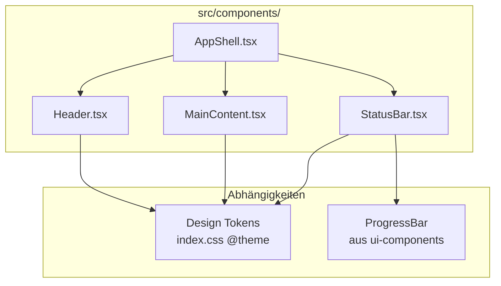
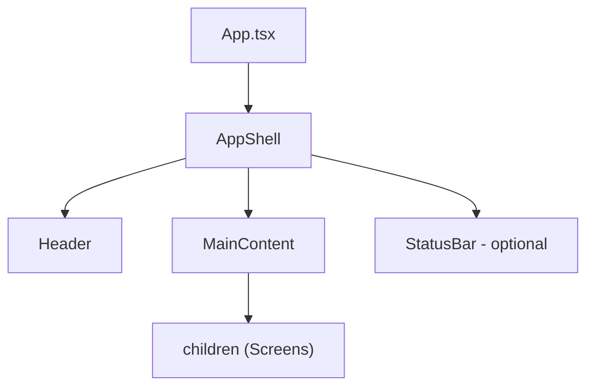

# Design Document: Application Layout

## Overview

Dieses Design beschreibt die Implementierung der Application Shell (AppShell) für die gamifizierte IT-Security Awareness Anwendung. Die AppShell ersetzt die bestehende einfache `Layout.tsx`-Komponente durch eine vollständige Seitenstruktur mit **Header**, **MainContent** und optionaler **StatusBar** im visuellen Stil einer Agenten-Missionszentrale.

Die Architektur folgt einem Composition-Pattern: Die `AppShell`-Komponente orchestriert die drei Layout-Bereiche, wobei jeder Bereich eine eigenständige Komponente mit typisierten Props ist.

### Design-Entscheidungen

| Entscheidung | Gewählt | Begründung |
|---|---|---|
| Composition Pattern | AppShell als Container, Kinder als Props | Flexibel, testbar, React-Standard |
| Flexbox statt Grid | `flex flex-col h-screen` | Einfacher für vertikales Stacking, bessere Browser-Unterstützung |
| Glow-Effekt | `border-b border-accent-primary/20` | Tailwind-nativer Ansatz, kein Custom CSS nötig |
| StatusBar Sichtbarkeit | `showStatusBar` Boolean-Prop | Einfachste Lösung, kein State-Management nötig |
| Responsive Breakpoint | 768px (Tailwind `md:`) | Standard Mobile-First Breakpoint, passt zu existierendem Code |
| Animation | Opacity-Transition mit `duration-normal` Token | Subtil, respektiert `prefers-reduced-motion` automatisch über Design System |
| Dateiorganisation | Einzelne .tsx-Dateien in src/components/ | Konsistent mit existierender Struktur und ui-components Spec |

## Architecture

### Komponentenstruktur



### Kompositions-Hierarchie



### Dateistruktur

```
src/components/
├── AppShell.tsx        # Orchestriert Header + MainContent + StatusBar
├── Header.tsx         # Fixierter Kopfbereich mit Branding + Status
├── MainContent.tsx    # Scrollbarer Inhaltsbereich mit max-width Container
├── StatusBar.tsx      # Optionale Fußleiste mit Fortschritt
├── Button.tsx         # Bestehend (aus ui-components)
├── Card.tsx           # Bestehend (aus ui-components)
├── Badge.tsx          # Bestehend (aus ui-components)
├── ProgressBar.tsx    # Bestehend (aus ui-components, genutzt von StatusBar)
├── IconWrapper.tsx    # Bestehend (aus ui-components)
└── Layout.tsx         # Wird durch AppShell ersetzt (deprecated)
```

### Visuelles Layout

```
┌──────────────────────────────────────────────┐
│  Header (fixed height, bg-secondary)         │
│  ┌─────────────┐         ┌────────────────┐  │
│  │ Title       │         │ Score / Badge  │  │
│  └─────────────┘         └────────────────┘  │
├──────────────────────────────────────────────┤ ← glow border (accent-primary/20)
│                                              │
│  MainContent (flex-1, overflow-y-auto)       │
│  ┌────────────────────────────────────────┐  │
│  │  Inner Container (max-width: 600px)    │  │
│  │  ┌──────────────────────────────────┐  │  │
│  │  │  children (Screens)              │  │  │
│  │  └──────────────────────────────────┘  │  │
│  └────────────────────────────────────────┘  │
│                                              │
├──────────────────────────────────────────────┤ ← glow border (accent-primary/20)
│  StatusBar (fixed height, bg-secondary)      │
│  ┌─────────────┐  ┌──────────────────────┐  │
│  │ Label       │  │ ProgressBar          │  │
│  └─────────────┘  └──────────────────────┘  │
└──────────────────────────────────────────────┘
```

### Integration in App.tsx

Die bestehende `App.tsx` wird migriert von:

```tsx
// Vorher
<div className="app">
  <Layout>{screens}</Layout>
</div>

// Nachher
<AppShell 
  showStatusBar={isInMission}
  headerProps={{ title: 'IT Security Awareness', score: currentScore }}
  statusBarProps={{ progress: missionProgress, label: 'Mission 1' }}
>
  {screens}
</AppShell>
```

## Components and Interfaces

### 1. AppShell Component

```typescript
import type { ReactNode } from 'react';

export interface StatusBarConfig {
  /** Fortschrittswert 0–100 */
  progress?: number;
  /** Beschriftungstext */
  label?: string;
  /** Zusätzliche CSS-Klassen */
  className?: string;
}

export interface HeaderConfig {
  /** Anwendungstitel */
  title?: string;
  /** Aktueller Spielstand */
  score?: number;
  /** Mission-Badge Inhalt */
  missionBadge?: ReactNode;
}

export interface AppShellProps {
  /** Inhalt für den MainContent-Bereich */
  children: ReactNode;
  /** Ob die StatusBar angezeigt wird */
  showStatusBar?: boolean;
  /** Props für die StatusBar */
  statusBarProps?: StatusBarConfig;
  /** Props für den Header */
  headerProps?: HeaderConfig;
}
```

**Implementierungsansatz:**

```tsx
function AppShell({
  children,
  showStatusBar = false,
  statusBarProps,
  headerProps,
}: AppShellProps) {
  return (
    <div className="flex flex-col h-screen bg-bg-primary">
      <Header
        title={headerProps?.title}
        score={headerProps?.score}
        missionBadge={headerProps?.missionBadge}
      />
      <MainContent>{children}</MainContent>
      {showStatusBar && (
        <StatusBar
          progress={statusBarProps?.progress}
          label={statusBarProps?.label}
          className={statusBarProps?.className}
        />
      )}
    </div>
  );
}
```

### 2. Header Component

```typescript
import type { ReactNode } from 'react';

export interface HeaderProps {
  /** Anwendungstitel (Standard: 'IT Security Awareness') */
  title?: string;
  /** Aktueller Spielstand */
  score?: number;
  /** Mission-Badge Inhalt (z.B. Badge-Komponente) */
  missionBadge?: ReactNode;
}
```

**Implementierungsansatz:**

```tsx
function Header({
  title = 'IT Security Awareness',
  score,
  missionBadge,
}: HeaderProps) {
  return (
    <header className="flex items-center justify-between px-4 md:px-6 h-14 bg-bg-secondary border-b border-accent-primary/20 shrink-0">
      <h1 className="text-lg font-bold text-text-primary truncate">
        {title}
      </h1>
      <div className="flex items-center gap-3">
        {score !== undefined && (
          <span className="text-sm font-medium text-accent-primary">
            {score} Punkte
          </span>
        )}
        {missionBadge}
      </div>
    </header>
  );
}
```

**Styling-Details:**
- Feste Höhe `h-14` (56px) — genug Platz für Titel + Status
- `shrink-0` verhindert, dass Flexbox den Header komprimiert
- `truncate` auf dem Titel verhindert Overflow bei langen Titeln
- Bottom-Border: `border-b border-accent-primary/20` erzeugt den subtilen Glow-Separator
- Responsive Padding: `px-4` (16px mobile) → `md:px-6` (32px ab 768px)

### 3. MainContent Component

```typescript
import type { ReactNode } from 'react';

export interface MainContentProps {
  /** Seiteninhalt */
  children: ReactNode;
  /** Zusätzliche CSS-Klassen für den äußeren Container */
  className?: string;
}
```

**Implementierungsansatz:**

```tsx
function MainContent({ children, className }: MainContentProps) {
  return (
    <main className={`flex-1 overflow-y-auto ${className ?? ''}`}>
      <div className="w-full max-w-[var(--max-width)] mx-auto px-4 md:px-6 py-4">
        {children}
      </div>
    </main>
  );
}
```

**Styling-Details:**
- `flex-1` füllt den verbleibenden vertikalen Raum zwischen Header und StatusBar
- `overflow-y-auto` aktiviert Scrolling nur bei Overflow
- Innerer Container: `max-w-[var(--max-width)]` nutzt den `--max-width: 600px` Token
- `mx-auto` zentriert den Container horizontal
- Responsive Padding: `px-4 md:px-6` + vertikales `py-4`

### 4. StatusBar Component

```typescript
export interface StatusBarProps {
  /** Fortschrittswert 0–100 */
  progress?: number;
  /** Beschriftungstext neben dem Fortschrittsbalken */
  label?: string;
  /** Zusätzliche CSS-Klassen */
  className?: string;
}
```

**Implementierungsansatz:**

```tsx
function StatusBar({ progress, label, className }: StatusBarProps) {
  return (
    <footer
      className={`flex items-center px-4 md:px-6 h-12 bg-bg-secondary border-t border-accent-primary/20 shrink-0 animate-fade-in ${className ?? ''}`}
    >
      <div className="flex items-center gap-3 w-full max-w-[var(--max-width)] mx-auto">
        {label && (
          <span className="text-xs text-text-secondary whitespace-nowrap">
            {label}
          </span>
        )}
        {progress !== undefined && (
          <div className="flex-1">
            <ProgressBar value={progress} size="sm" />
          </div>
        )}
      </div>
    </footer>
  );
}
```

**Styling-Details:**
- Feste Höhe `h-12` (48px) — kompakt, nicht aufdringlich
- `shrink-0` verhindert Komprimierung durch Flexbox
- Top-Border: `border-t border-accent-primary/20` — spiegelt den Header-Separator
- Entry-Animation: `animate-fade-in` — eigene Tailwind-Utility via `@theme`

**Animation-Definition (in index.css @theme erweitern):**

```css
@theme {
  --animate-fade-in: fade-in var(--duration-normal) var(--ease-out);
}

@keyframes fade-in {
  from { opacity: 0; }
  to { opacity: 1; }
}
```

Die `prefers-reduced-motion` Media Query im Design System setzt `--duration-normal` automatisch auf `0ms`, wodurch die Animation übersprungen wird.

## Data Models

### Props-Zusammenfassung

| Komponente | Pflicht-Props | Optionale Props | Defaults |
|---|---|---|---|
| AppShell | `children` | `showStatusBar`, `statusBarProps`, `headerProps` | showStatusBar: false |
| Header | — | `title`, `score`, `missionBadge` | title: 'IT Security Awareness' |
| MainContent | `children` | `className` | — |
| StatusBar | — | `progress`, `label`, `className` | — |

### Typ-Übersicht

```typescript
// Alle exportierten Interfaces
export interface AppShellProps {
  children: ReactNode;
  showStatusBar?: boolean;
  statusBarProps?: StatusBarConfig;
  headerProps?: HeaderConfig;
}

export interface HeaderConfig {
  title?: string;
  score?: number;
  missionBadge?: ReactNode;
}

export interface HeaderProps {
  title?: string;
  score?: number;
  missionBadge?: ReactNode;
}

export interface MainContentProps {
  children: ReactNode;
  className?: string;
}

export interface StatusBarProps {
  progress?: number;
  label?: string;
  className?: string;
}

export interface StatusBarConfig {
  progress?: number;
  label?: string;
  className?: string;
}
```

### Design Token Nutzung

| Token | Tailwind Utility | Verwendung |
|---|---|---|
| --color-bg-primary | `bg-bg-primary` | AppShell Hintergrund |
| --color-bg-secondary | `bg-bg-secondary` | Header + StatusBar Hintergrund |
| --color-accent-primary | `border-accent-primary/20` | Glow-Separator-Border |
| --color-text-primary | `text-text-primary` | Header-Titel |
| --color-text-secondary | `text-text-secondary` | StatusBar-Label |
| --color-accent-primary | `text-accent-primary` | Score-Anzeige |
| --spacing-4 (16px) | `px-4`, `py-4` | Mobile Padding |
| --spacing-6 (32px) | `md:px-6` | Desktop Padding |
| --max-width (600px) | `max-w-[var(--max-width)]` | Content-Container Breite |
| --duration-normal (300ms) | über animate-fade-in | StatusBar Entry-Animation |

## Correctness Properties

*A property is a characteristic or behavior that should hold true across all valid executions of a system — essentially, a formal statement about what the system should do. Properties serve as the bridge between human-readable specifications and machine-verifiable correctness guarantees.*

### Property 1: Children pass-through in MainContent Container

*For any* ReactNode passed as `children` to AppShell, the rendered text content of those children SHALL appear within the `<main>` landmark element's inner container (the element with max-width constraint).

**Validates: Requirements 1.3, 3.7**

### Property 2: Header renders provided title and score

*For any* non-empty title string and any numeric score value passed to Header, the rendered `<header>` element SHALL contain both the title text and the score number as visible text content.

**Validates: Requirements 2.2, 2.8**

### Property 3: StatusBar reflects progress value and label

*For any* progress value between 0 and 100 and any non-empty label string passed to StatusBar, the rendered `<footer>` element SHALL contain the label text and a progress indicator with `aria-valuenow` equal to the progress value.

**Validates: Requirements 4.6, 4.7**

### Property 4: Single main landmark invariant

*For any* combination of `showStatusBar` (true or false) and any children content, the AppShell SHALL render exactly one `<main>` HTML element in the DOM output.

**Validates: Requirements 6.4**

## Error Handling

### Props-Validierung

| Komponente | Fehlerfall | Verhalten |
|---|---|---|
| AppShell | `children` ist undefined | Leerer MainContent (React rendert nichts) |
| AppShell | `statusBarProps` ohne `showStatusBar` | StatusBar wird nicht gerendert, Props werden ignoriert |
| Header | `title` ist leerer String | Leeres `<h1>` wird gerendert (akzeptabel) |
| Header | `score` ist NaN | `NaN Punkte` wird angezeigt — sollte vom Consumer validiert werden |
| StatusBar | `progress` < 0 oder > 100 | ProgressBar klemmt intern auf 0–100 (bestehendes Verhalten) |
| StatusBar | `progress` undefined + `label` undefined | Footer wird ohne Inhalt gerendert |

### Fehlendes Design System

Falls das Design System (Tailwind @theme + Design Tokens) nicht korrekt konfiguriert ist:
- Fehlende Farb-Token → Hintergrund/Border wird transparent (kein Crash)
- Fehlende Animation-Keyframes → StatusBar erscheint sofort ohne Animation
- Fehlender `--max-width` Token → `max-w-[var(--max-width)]` wird ignoriert, Container ist unbegrenzt breit

### Viewport-Extremfälle

| Szenario | Verhalten |
|---|---|
| Viewport < 320px | Layout funktioniert, Content kann horizontal abgeschnitten werden |
| Viewport > 1440px | Content bleibt bei 600px max-width zentriert |
| Höhe < Header + StatusBar | MainContent hat 0px Höhe, kein Scrolling möglich |

## Testing Strategy

### Test-Tooling

- **Vitest** als Test-Runner (bereits konfiguriert via ui-components Spec)
- **React Testing Library** (@testing-library/react) für Komponentenrendering
- **@testing-library/jest-dom** für DOM-Assertions
- **fast-check** für Property-Based Tests

### Warum Property-Based Testing hier passt

Die Layout-Komponenten haben klare Props-zu-DOM-Beziehungen:
- Beliebige `children`-Inhalte müssen korrekt durchgereicht werden
- Numerische `score`/`progress`-Werte müssen im DOM erscheinen
- String-Props (`title`, `label`) müssen als Text gerendert werden
- Strukturelle Invarianten (genau ein `<main>`) müssen für alle Konfigurationen gelten

Der Input-Space ist groß genug (beliebige Strings, Zahlen, Booleans), dass PBT Wert schafft.

### Test-Struktur

```
src/components/__tests__/
├── AppShell.test.tsx        # Unit + Property Tests
├── Header.test.tsx          # Unit + Property Tests
├── MainContent.test.tsx     # Unit + Property Tests
└── StatusBar.test.tsx       # Unit + Property Tests
```

### Property-Based Tests (fast-check, min. 100 Iterationen)

```typescript
// Feature: application-layout, Property 1: Children pass-through
fc.assert(
  fc.property(fc.string({ minLength: 1 }), (text) => {
    const { getByRole } = render(
      <AppShell><p>{text}</p></AppShell>
    );
    const main = getByRole('main');
    expect(main).toHaveTextContent(text);
  }),
  { numRuns: 100 }
);

// Feature: application-layout, Property 2: Header title and score
fc.assert(
  fc.property(
    fc.string({ minLength: 1, maxLength: 100 }),
    fc.integer({ min: 0, max: 99999 }),
    (title, score) => {
      const { getByRole } = render(<Header title={title} score={score} />);
      const header = getByRole('banner');
      expect(header).toHaveTextContent(title);
      expect(header).toHaveTextContent(String(score));
    }
  ),
  { numRuns: 100 }
);

// Feature: application-layout, Property 3: StatusBar progress and label
fc.assert(
  fc.property(
    fc.integer({ min: 0, max: 100 }),
    fc.string({ minLength: 1, maxLength: 50 }),
    (progress, label) => {
      const { getByRole } = render(<StatusBar progress={progress} label={label} />);
      const footer = getByRole('contentinfo');
      expect(footer).toHaveTextContent(label);
      const progressBar = getByRole('progressbar');
      expect(progressBar).toHaveAttribute('aria-valuenow', String(progress));
    }
  ),
  { numRuns: 100 }
);

// Feature: application-layout, Property 4: Single main landmark
fc.assert(
  fc.property(fc.boolean(), fc.string(), (showStatusBar, text) => {
    const { container } = render(
      <AppShell showStatusBar={showStatusBar}>
        <p>{text}</p>
      </AppShell>
    );
    const mains = container.querySelectorAll('main');
    expect(mains).toHaveLength(1);
  }),
  { numRuns: 100 }
);
```

### Unit-Tests (Beispiel-basiert)

Unit Tests decken ab:
- **AppShell**: Renders Header, MainContent, conditional StatusBar
- **Header**: Default title, glow border class, responsive padding classes, layout direction
- **MainContent**: flex-1 class, overflow-y-auto, max-width container, mx-auto centering
- **StatusBar**: footer element, glow border class, animation class, content centering
- **Responsive classes**: px-4 + md:px-6 Präsenz auf Header, MainContent, StatusBar
- **Accessibility**: Landmark-Elemente (header, main, footer), keine Keyboard-Traps

### Tags für Property Tests

Format: **Feature: application-layout, Property {number}: {title}**

- Feature: application-layout, Property 1: Children pass-through in MainContent Container
- Feature: application-layout, Property 2: Header renders provided title and score
- Feature: application-layout, Property 3: StatusBar reflects progress value and label
- Feature: application-layout, Property 4: Single main landmark invariant
