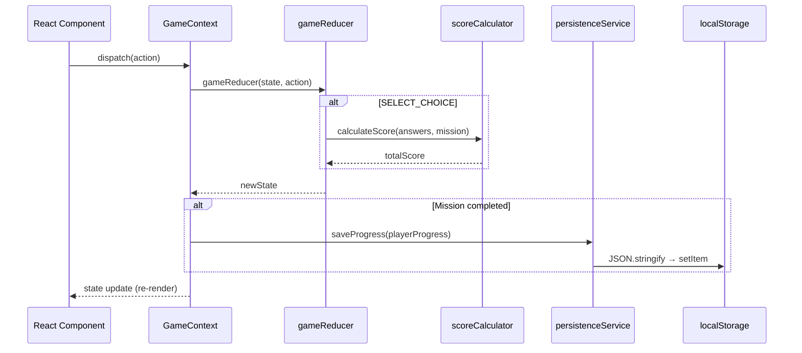
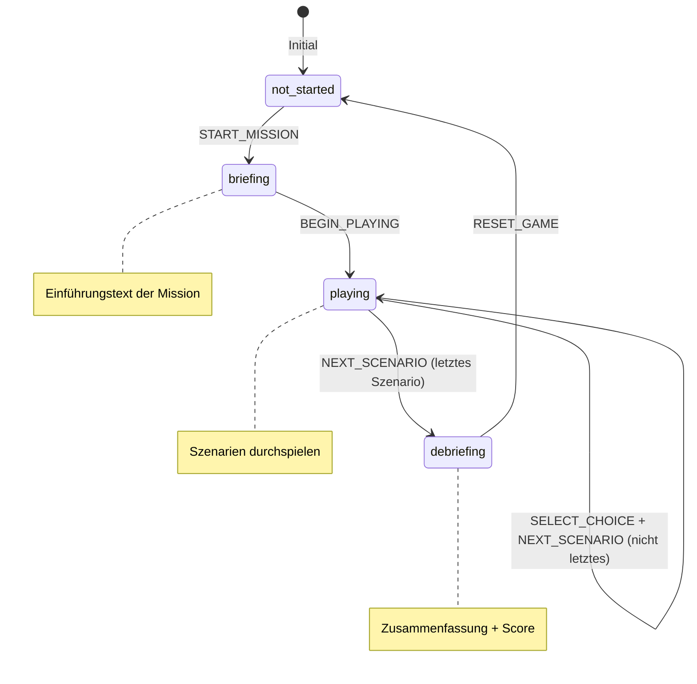
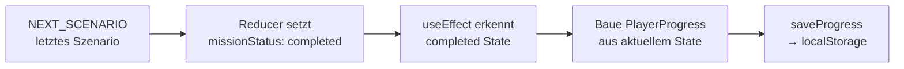

# Design Document: Game State

## Overview

Dieses Dokument spezifiziert die technische Architektur für den Game State der gamifizierten IT-Security Awareness Anwendung. Der Game State bildet das Fundament für alle spielrelevanten Daten: Missionen, Szenarien, Entscheidungen, Punktestand und Fortschritt.

Die Architektur folgt dem Prinzip strikter Trennung:
- **Typen** (`src/types/`) — Reine Datenstrukturen ohne Logik
- **Logik** (`src/services/`) — Pure Funktionen für Score-Berechnung und Persistenz
- **State Management** (`src/hooks/`) — React Context + useReducer
- **Daten** (zukünftig `src/data/`) — Missionsinhalte als JSON-artige Objekte

### Design-Entscheidungen

| Entscheidung | Gewählt | Begründung |
|---|---|---|
| State Management | React Context + useReducer | Kein externes Paket (kein Redux/Zustand), ausreichend für MVP-Scope |
| Persistenz | localStorage mit Runtime-Validierung | Kein Backend, einfachste Lösung für Browser-Prototyp |
| Score-Berechnung | Pure Funktion in `src/services/` | Unabhängig testbar, keine Side Effects |
| Typen-Organisation | Einzelne Datei `src/types/game.types.ts` | Alle Game-State-Typen zusammen, da sie eng gekoppelt sind |
| Mission-Phase State Machine | Literal Union Types + Reducer-Logik | Kein separates State-Machine-Library nötig |
| Testing | fast-check für Property-Based Tests | Standard-PBT-Library für TypeScript, leichtgewichtig |

## Architecture

### Architektur-Übersicht

```mermaid
graph TD
    subgraph "src/types/"
        T[game.types.ts<br/>Mission, Scenario, Choice,<br/>GameState, PlayerProgress,<br/>Achievement, GameAction]
    end

    subgraph "src/services/"
        SC[score-calculator.ts<br/>calculateScore()]
        PS[persistence-service.ts<br/>saveProgress() / loadProgress()]
    end

    subgraph "src/hooks/"
        GC[use-game-state.tsx<br/>GameContext, GameProvider,<br/>useGameState(), gameReducer()]
    end

    subgraph "React Components"
        APP[App.tsx]
        FEAT[features/game/*<br/>features/menu/*<br/>features/results/*]
    end

    T --> SC
    T --> PS
    T --> GC
    GC --> SC
    GC --> PS
    GC --> APP
    APP --> FEAT
```

### Datei-Struktur

```
src/
├── types/
│   └── game.types.ts          # Alle Game-State TypeScript Interfaces
├── services/
│   ├── score-calculator.ts    # Pure Score-Berechnung
│   └── persistence-service.ts # localStorage Load/Save mit Validierung
├── hooks/
│   └── use-game-state.tsx     # GameContext, GameProvider, useGameState Hook
└── ...
```

### Datenfluss



### Mission-Phase State Machine



## Components and Interfaces

### 1. TypeScript Interfaces (`src/types/game.types.ts`)

```typescript
// === Basis-Typen ===

export interface Choice {
  readonly id: string;
  readonly text: string;
  readonly points: number;
  readonly feedback: string;
  readonly isCorrect: boolean;
}

export interface Scenario {
  readonly id: string;
  readonly context: string;
  readonly choices: readonly Choice[]; // Min. 2 Choices
  readonly correctChoiceId: string;
}

export interface Mission {
  readonly id: string;
  readonly title: string;
  readonly description: string;
  readonly scenarios: readonly Scenario[];
  readonly category: string; // z.B. "phishing", "social-engineering", "passwords"
}

// === State-Typen ===

export type MissionPhase = 'briefing' | 'playing' | 'debriefing';
export type MissionStatus = 'not-started' | 'in-progress' | 'completed';

export interface Answer {
  readonly scenarioId: string;
  readonly choiceId: string;
}

export interface GameState {
  readonly currentMission: Mission | null;
  readonly currentScenarioIndex: number;
  readonly score: number;
  readonly answers: readonly Answer[];
  readonly phase: MissionPhase;
  readonly missionStatus: MissionStatus;
}

// === Fortschritt-Typen ===

export interface CompletedMission {
  readonly missionId: string;
  readonly score: number;
  readonly completedAt: string; // ISO 8601
}

export interface PlayerProgress {
  readonly completedMissions: readonly CompletedMission[];
  readonly totalScore: number;
  readonly unlockedAchievements: readonly string[];
  readonly lastPlayedAt: string; // ISO 8601
}

export interface Achievement {
  readonly id: string;
  readonly title: string;
  readonly description: string;
  readonly condition: string; // Machine-evaluable Bedingung
  readonly icon: string;
}

// === Action-Typen ===

export type GameAction =
  | { type: 'START_MISSION'; payload: Mission }
  | { type: 'BEGIN_PLAYING' }
  | { type: 'SELECT_CHOICE'; payload: { scenarioId: string; choiceId: string } }
  | { type: 'NEXT_SCENARIO' }
  | { type: 'RESET_GAME' };
```

### 2. Game Reducer (`src/hooks/use-game-state.tsx`)

```typescript
import { createContext, useContext, useReducer, type ReactNode } from 'react';
import type { GameState, GameAction, Mission } from '../types/game.types';
import { calculateScore } from '../services/score-calculator';
import { saveProgress, loadProgress } from '../services/persistence-service';

// === Default State ===

export const DEFAULT_GAME_STATE: GameState = {
  currentMission: null,
  currentScenarioIndex: 0,
  score: 0,
  answers: [],
  phase: 'briefing',
  missionStatus: 'not-started',
};

// === Pure Reducer ===

export function gameReducer(state: GameState, action: GameAction): GameState {
  switch (action.type) {
    case 'START_MISSION':
      return {
        currentMission: action.payload,
        currentScenarioIndex: 0,
        score: 0,
        answers: [],
        phase: 'briefing',
        missionStatus: 'in-progress',
      };

    case 'BEGIN_PLAYING':
      return { ...state, phase: 'playing' };

    case 'SELECT_CHOICE': {
      const { scenarioId, choiceId } = action.payload;
      const newAnswers = [...state.answers, { scenarioId, choiceId }];
      const newScore = state.currentMission
        ? calculateScore(newAnswers, state.currentMission)
        : state.score;
      return { ...state, answers: newAnswers, score: newScore };
    }

    case 'NEXT_SCENARIO': {
      const nextIndex = state.currentScenarioIndex + 1;
      const totalScenarios = state.currentMission?.scenarios.length ?? 0;

      if (nextIndex >= totalScenarios) {
        return { ...state, currentScenarioIndex: nextIndex, phase: 'debriefing', missionStatus: 'completed' };
      }
      return { ...state, currentScenarioIndex: nextIndex };
    }

    case 'RESET_GAME':
      return DEFAULT_GAME_STATE;

    default:
      return state;
  }
}

// === Context ===

interface GameContextValue {
  state: GameState;
  dispatch: React.Dispatch<GameAction>;
}

const GameContext = createContext<GameContextValue | null>(null);

// === Provider ===

interface GameProviderProps {
  children: ReactNode;
}

export function GameProvider({ children }: GameProviderProps) {
  const [state, dispatch] = useReducer(gameReducer, DEFAULT_GAME_STATE);

  // Persist on mission completion
  // (Side effect handled in Provider, Reducer bleibt pure)
  // Implementation: useEffect watching state.missionStatus === 'completed'

  return (
    <GameContext.Provider value={{ state, dispatch }}>
      {children}
    </GameContext.Provider>
  );
}

// === Hook ===

export function useGameState(): GameContextValue {
  const context = useContext(GameContext);
  if (!context) {
    throw new Error('useGameState must be used within a GameProvider');
  }
  return context;
}
```

### 3. Score Calculator (`src/services/score-calculator.ts`)

```typescript
import type { Answer, Mission } from '../types/game.types';

/**
 * Pure Funktion: Berechnet den Gesamtscore basierend auf Antworten und Missionsdaten.
 * Unbekannte Choice-IDs werden mit 0 Punkten bewertet.
 */
export function calculateScore(answers: readonly Answer[], mission: Mission): number {
  return answers.reduce((total, answer) => {
    const scenario = mission.scenarios.find(s => s.id === answer.scenarioId);
    if (!scenario) return total;

    const choice = scenario.choices.find(c => c.id === answer.choiceId);
    return total + (choice?.points ?? 0);
  }, 0);
}
```

### 4. Persistence Service (`src/services/persistence-service.ts`)

```typescript
import type { PlayerProgress } from '../types/game.types';

const STORAGE_KEY = 'it-security-game-progress';

// === Default Progress ===

function createDefaultProgress(): PlayerProgress {
  return {
    completedMissions: [],
    totalScore: 0,
    unlockedAchievements: [],
    lastPlayedAt: new Date().toISOString(),
  };
}

// === Runtime Validation ===

function isValidPlayerProgress(data: unknown): data is PlayerProgress {
  if (typeof data !== 'object' || data === null) return false;

  const obj = data as Record<string, unknown>;

  if (!Array.isArray(obj.completedMissions)) return false;
  if (typeof obj.totalScore !== 'number') return false;
  if (!Array.isArray(obj.unlockedAchievements)) return false;
  if (typeof obj.lastPlayedAt !== 'string') return false;

  // Validate completedMissions entries
  for (const entry of obj.completedMissions) {
    if (typeof entry !== 'object' || entry === null) return false;
    const mission = entry as Record<string, unknown>;
    if (typeof mission.missionId !== 'string') return false;
    if (typeof mission.score !== 'number') return false;
    if (typeof mission.completedAt !== 'string') return false;
  }

  // Validate unlockedAchievements entries
  for (const id of obj.unlockedAchievements) {
    if (typeof id !== 'string') return false;
  }

  return true;
}

// === Public API ===

export function saveProgress(progress: PlayerProgress): void {
  const json = JSON.stringify(progress);
  localStorage.setItem(STORAGE_KEY, json);
}

export function loadProgress(): PlayerProgress {
  try {
    const raw = localStorage.getItem(STORAGE_KEY);
    if (raw === null) return createDefaultProgress();

    const parsed: unknown = JSON.parse(raw);

    if (!isValidPlayerProgress(parsed)) {
      return createDefaultProgress();
    }

    return parsed;
  } catch {
    return createDefaultProgress();
  }
}
```

## Data Models

### GameState Zustandsdiagramm

Der GameState durchläuft folgende valide Zustands-Kombinationen:

| missionStatus | phase | currentMission | Beschreibung |
|---|---|---|---|
| `not-started` | `briefing` | `null` | Initialzustand, keine Mission aktiv |
| `in-progress` | `briefing` | `Mission` | Mission gestartet, Einführung wird gezeigt |
| `in-progress` | `playing` | `Mission` | Spieler beantwortet Szenarien |
| `completed` | `debriefing` | `Mission` | Alle Szenarien beantwortet, Zusammenfassung |

### Invarianten

1. `currentScenarioIndex` ist stets `>= 0` und `<= scenarios.length`
2. `answers.length <= scenarios.length` (maximal eine Antwort pro Szenario)
3. Wenn `missionStatus === 'not-started'`, dann `currentMission === null`
4. Wenn `missionStatus === 'completed'`, dann `phase === 'debriefing'`
5. `score >= 0` (negative Punkte sind nicht vorgesehen)

### PlayerProgress Persistenz-Schema

```json
{
  "completedMissions": [
    {
      "missionId": "phishing-01",
      "score": 85,
      "completedAt": "2025-01-15T14:30:00.000Z"
    }
  ],
  "totalScore": 85,
  "unlockedAchievements": ["first-mission-complete"],
  "lastPlayedAt": "2025-01-15T14:30:00.000Z"
}
```

### Datenfluss bei Mission-Abschluss




## Correctness Properties

*A property is a characteristic or behavior that should hold true across all valid executions of a system — essentially, a formal statement about what the system should do. Properties serve as the bridge between human-readable specifications and machine-verifiable correctness guarantees.*

### Property 1: Serialization Round-Trip

*For any* valid PlayerProgress object, serializing it via `saveProgress` and then deserializing via `loadProgress` SHALL produce an object deeply equal to the original.

**Validates: Requirements 8.1, 8.2, 8.4, 7.2**

### Property 2: Score equals sum of selected choice points

*For any* valid Mission and any array of valid Answers (where each answer references an existing scenario and choice), `calculateScore` SHALL return a value equal to the sum of the `points` fields of all selected choices.

**Validates: Requirements 6.1, 6.2**

### Property 3: Invalid choice ID contributes zero points

*For any* valid Mission and any Answer whose `choiceId` does not exist in the referenced scenario's choices array, that answer SHALL contribute 0 to the total score returned by `calculateScore`.

**Validates: Requirements 6.3**

### Property 4: START_MISSION resets to mission state

*For any* valid Mission object and any prior GameState, dispatching a `START_MISSION` action SHALL produce a state with `currentMission` set to the payload mission, `score` at 0, `currentScenarioIndex` at 0, `answers` as empty array, `phase` as "briefing", and `missionStatus` as "in-progress".

**Validates: Requirements 5.3**

### Property 5: NEXT_SCENARIO advances index or transitions to debriefing

*For any* GameState with a non-null `currentMission` and `phase` of "playing": if `currentScenarioIndex < scenarios.length - 1`, dispatching `NEXT_SCENARIO` SHALL increment `currentScenarioIndex` by 1 while preserving all other fields. If `currentScenarioIndex >= scenarios.length - 1`, dispatching `NEXT_SCENARIO` SHALL set `phase` to "debriefing" and `missionStatus` to "completed".

**Validates: Requirements 5.6, 5.7**

### Property 6: RESET_GAME returns default state

*For any* GameState (regardless of current values), dispatching `RESET_GAME` SHALL return a state identical to DEFAULT_GAME_STATE.

**Validates: Requirements 5.8**

### Property 7: Invalid localStorage data yields default progress

*For any* string stored in localStorage under the progress key that is not valid JSON or does not conform to the PlayerProgress structure, `loadProgress` SHALL return a default PlayerProgress with empty `completedMissions`, `totalScore` of 0, empty `unlockedAchievements`, and a valid ISO 8601 `lastPlayedAt`.

**Validates: Requirements 7.3, 7.4**

### Property 8: SELECT_CHOICE appends answer and updates score

*For any* GameState with a non-null `currentMission` in "playing" phase and any valid scenario/choice pair from that mission, dispatching `SELECT_CHOICE` SHALL append the answer to the `answers` array (increasing its length by 1) and set `score` to the result of `calculateScore` with the new answers array.

**Validates: Requirements 5.5**

## Error Handling

### Reducer Fehlerbehandlung

| Situation | Verhalten | Begründung |
|---|---|---|
| Unbekannter Action-Type | Aktuellen State unverändert zurückgeben | Standard Reducer-Pattern, keine Exception |
| SELECT_CHOICE mit ungültiger choiceId | Antwort wird gespeichert, Score +0 | Graceful degradation, scoreCalculator behandelt fehlende IDs |
| NEXT_SCENARIO ohne aktive Mission | State bleibt unverändert (totalScenarios = 0) | Keine Exception, defensive Logik |
| BEGIN_PLAYING im falschen Phase | Phase wird überschrieben | Einfachste Implementierung für MVP |

### Persistence Fehlerbehandlung

| Situation | Verhalten | Begründung |
|---|---|---|
| localStorage nicht verfügbar | `loadProgress` fängt Exception, gibt Default zurück | Privater Modus in manchen Browsern |
| Korrupte JSON-Daten | `JSON.parse` wirft, catch gibt Default zurück | Tamper-Schutz |
| Schema-Mismatch (fehlende Felder) | Validierung schlägt fehl, Default wird zurückgegeben | Versionswechsel-Robustheit |
| localStorage voll (QuotaExceededError) | `saveProgress` wirft, Fehler wird im Provider gefangen | PlayerProgress ist klein, unwahrscheinlich |
| Ungültiger Datentyp in Feldern | Validierung prüft jeden Typ explizit, Default bei Mismatch | Robustheit gegen manuelle Manipulation |

### Context Fehlerbehandlung

| Situation | Verhalten | Begründung |
|---|---|---|
| useGameState außerhalb Provider | Wirft Error mit klarer Message | Developer Experience, frühes Scheitern |
| Doppelter Provider im Tree | Innerer Provider überschreibt (React Standard) | Kein Spezialhandling nötig |

## Testing Strategy

### Testaufbau

**Library:** [fast-check](https://github.com/dubzzz/fast-check) für Property-Based Tests, Vitest als Test-Runner.

**Dateistruktur:**
```
src/
├── services/
│   ├── __tests__/
│   │   ├── score-calculator.property.test.ts    # PBT: Properties 2, 3
│   │   └── persistence-service.property.test.ts # PBT: Properties 1, 7
├── hooks/
│   ├── __tests__/
│   │   └── game-reducer.property.test.ts        # PBT: Properties 4, 5, 6, 8
```

### Property-Based Tests (fast-check)

Jeder Correctness Property wird als eigener Property-Based Test implementiert mit mindestens 100 Iterationen.

**Generatoren:**
- `arbitraryChoice()` — Generiert zufällige Choice-Objekte mit variablen Punktwerten
- `arbitraryScenario()` — Generiert Scenarios mit 2-5 Choices, setzt correctChoiceId korrekt
- `arbitraryMission()` — Generiert Missions mit 1-10 Scenarios
- `arbitraryPlayerProgress()` — Generiert PlayerProgress mit 0-5 completed missions
- `arbitraryGameState(mission)` — Generiert valide GameStates für eine gegebene Mission
- `arbitraryAnswer(mission)` — Generiert valide Answers die auf existierende Scenarios/Choices verweisen

**Tag-Format:** Jeder Test wird mit einem Kommentar versehen:
```typescript
// Feature: game-state, Property 1: Serialization Round-Trip
```

**Konfiguration:**
```typescript
fc.assert(
  fc.property(arbitraryPlayerProgress(), (progress) => {
    // ... assertion
  }),
  { numRuns: 100 }
);
```

### Unit Tests (Vitest)

Ergänzend zu den Property-Tests für spezifische Beispiele und Edge Cases:

- **Reducer:** Spezifische Zustandsübergänge mit konkreten Missions-Daten
- **Score Calculator:** Bekannte Szenarien mit erwarteten Punktzahlen
- **Persistence:** localStorage-Mocking, spezifische Fehlerszenarien
- **Context:** React Testing Library für Provider-Integration

### Test-Abdeckung

| Komponente | Property Tests | Unit Tests | Grund |
|---|---|---|---|
| `gameReducer` | Properties 4, 5, 6, 8 | Spezifische Transitions | Pure Funktion, ideal für PBT |
| `calculateScore` | Properties 2, 3 | Randfälle (leere Arrays) | Pure Funktion, ideal für PBT |
| `persistence-service` | Properties 1, 7 | localStorage Mocking | Serialisierung = klassischer Round-Trip |
| `GameProvider` | — | Integration mit React | Side Effects, nicht PBT-geeignet |
| Type Definitions | — | — | Compile-time Garantie durch TypeScript |
