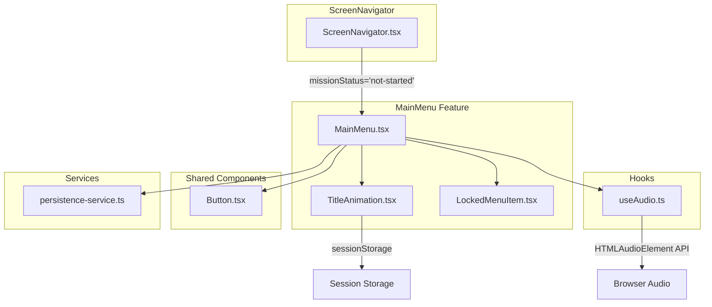

# Design Document: Main Menu

## Overview

Das Hauptmenü (Main Menu) ist der Einstiegsbildschirm von OPERATION SENTINEL. Es ersetzt den bisherigen `StartScreen` und wird vom `ScreenNavigator` angezeigt, wenn `missionStatus === 'not-started'`. Das Menü kombiniert visuelle Immersion (Hintergrundbild, Glitch-Animation, Hintergrundmusik) mit einer klar strukturierten Navigation (3 Menüpunkte, davon 2 gesperrt).

### Design-Entscheidungen

| Entscheidung | Begründung |
|---|---|
| `sessionStorage` für Animation-Flag | Animation soll nur 1× pro Tab-Session spielen; `sessionStorage` wird beim Tab-Schließen automatisch geleert |
| Eigener `useAudio`-Hook | Audio-Logik ist wiederverwendbar (z.B. für Missionsbildschirme); Separation of Concerns |
| `TitleAnimation` als eigene Komponente | Unabhängig testbar, konfigurierbar via Props, kein interner State-Leak in MainMenu |
| Bestehendes `Button`-Komponent für "Neues Spiel" | Konsistenz mit dem Design System; kein Duplizieren von Varianten |
| CSS `object-fit: cover` für Hintergrund | Behält 16:9-Proportionen bei jeder Viewport-Größe bei |
| Fallback-Farbe statt Platzhalter-Bild | Robustheit bei fehlenden Assets ohne visuellen Bruch |

## Architecture



### Datenfluss

1. `ScreenNavigator` prüft `missionStatus` → rendert `MainMenu`
2. `MainMenu` liest `sessionStorage` → entscheidet ob Animation spielt
3. `useAudio` initialisiert Audio-Elemente → startet Hintergrundmusik
4. User klickt "Neues Spiel" → `dispatch({ type: 'START_MISSION', payload: mission })`
5. User klickt gesperrten Eintrag → lokaler UI-State zeigt Hint (auto-dismiss nach 4s)

## Components and Interfaces

### MainMenu.tsx

```typescript
// src/features/menu/MainMenu.tsx
// Haupt-Screen-Komponente, ersetzt StartScreen

interface MainMenuProps {}

// Interner State:
// - visibleHint: string | null (aktuell angezeigte Hint-Nachricht)
// - hintTarget: 'missionen' | 'agentenakte' | null

// Verwendet:
// - useAudio() für Musik und UI-Sounds
// - useGameState() für dispatch
// - TitleAnimation-Komponente
// - LockedMenuItem-Komponente
// - Button-Komponente (variant="primary")
```

### TitleAnimation.tsx

```typescript
// src/features/menu/TitleAnimation.tsx

interface TitleAnimationProps {
  /** Titel-Text */
  title: string;
  /** Untertitel */
  subtitle: string;
  /** Max. Animationsdauer in ms (default: 3000) */
  duration?: number;
  /** Callback wenn Animation beendet */
  onComplete?: () => void;
  /** Animation überspringen (direkt statischen Zustand zeigen) */
  skipAnimation?: boolean;
}

// SessionStorage Key: 'main-menu-title-animation-played'
// Effekt: Glitch/Scan/Flicker via motion keyframes
// Klick-Handler: Springt innerhalb 300ms zum finalen Zustand
```

### LockedMenuItem.tsx

```typescript
// src/features/menu/LockedMenuItem.tsx

interface LockedMenuItemProps {
  /** Beschriftung des Menüpunkts */
  label: string;
  /** Callback bei Klick (zeigt Hint) */
  onClick: () => void;
  /** Hover-Sound abspielen */
  onHover?: () => void;
}

// Rendering:
// - lucide-react Lock-Icon links
// - opacity-50, kein Glow
// - cursor: not-allowed
// - aria-disabled="true"
// - tabIndex=0, kein Navigationseffekt bei Enter/Space
// - Hover: leichte Helligkeitszunahme (brightness)
```

### useAudio Hook

```typescript
// src/hooks/useAudio.ts

interface UseAudioOptions {
  /** Pfad zur Hintergrundmusik */
  musicSrc?: string;
  /** Lautstärke der Musik (0.0–1.0) */
  musicVolume?: number;
  /** Pfad zum Hover-Sound */
  hoverSrc?: string;
  /** Pfad zum Click-Sound */
  clickSrc?: string;
  /** Pfad zum Locked-Click-Sound */
  lockedClickSrc?: string;
  /** Lautstärke der UI-Sounds (0.0–1.0) */
  uiVolume?: number;
}

interface UseAudioReturn {
  /** Musik starten (mit Autoplay-Fallback) */
  startMusic: () => void;
  /** Musik mit Fade-Out stoppen */
  stopMusic: (fadeMs?: number) => void;
  /** Hover-Sound abspielen */
  playHover: () => void;
  /** Click-Sound abspielen */
  playClick: () => void;
  /** Locked-Click-Sound abspielen (für gesperrte Menüpunkte) */
  playLockedClick: () => void;
  /** Aufräumen (bei Unmount) */
  cleanup: () => void;
}

// Implementierungsdetails:
// - Erstellt HTMLAudioElement-Instanzen
// - Musik: loop=true, volume=0.3
// - UI-Sounds: volume=0.2
// - Fade-Out: Intervall reduziert volume schrittweise über fadeMs
// - Autoplay-Fallback: Fängt play() Promise-Rejection, setzt Event-Listener
// - Hover-Sound: Stoppt vorherigen, startet von vorn (currentTime=0)
// - Locked-Click-Sound: Eigenes Audio-Element für gesperrte Menüpunkte
// - Cleanup bei Komponenten-Unmount (useEffect return)
```

## Data Models

### UI State (lokal in MainMenu)

```typescript
interface MainMenuUIState {
  /** Aktuell sichtbare Hint-Nachricht, oder null */
  visibleHint: string | null;
  /** Welcher gesperrte Eintrag den Hint ausgelöst hat */
  hintTarget: 'missionen' | 'agentenakte' | null;
  /** Timer-ID für Auto-Dismiss */
  hintTimerId: ReturnType<typeof setTimeout> | null;
}
```

### Menü-Konfiguration (statisch)

```typescript
interface MenuItemConfig {
  id: string;
  label: string;
  type: 'active' | 'locked';
  icon: LucideIcon;
  hintMessage?: string; // max 120 Zeichen
}

const MENU_ITEMS: MenuItemConfig[] = [
  {
    id: 'new-game',
    label: 'Neues Spiel',
    type: 'active',
    icon: Play,
  },
  {
    id: 'missions',
    label: 'Missionen',
    type: 'locked',
    icon: Lock,
    hintMessage: 'Initialisiere zuerst deinen Agenten, um Zugriff auf das Missionsnetzwerk zu erhalten.',
  },
  {
    id: 'agent-file',
    label: 'Agentenakte',
    type: 'locked',
    icon: Lock,
    hintMessage: 'Erstelle zuerst einen Agenten, um deine Akte einsehen zu können.',
  },
];
```

### SessionStorage

| Key | Typ | Beschreibung |
|---|---|---|
| `main-menu-title-animation-played` | `"true"` | Flag ob Titel-Animation bereits gespielt hat |

### Asset-Pfade

| Asset | Pfad (relativ zu public/) |
|---|---|
| Hintergrundbild | `assets/images/Mainmenu.png` |
| Logo | `assets/images/Logo.png` |
| Hintergrundmusik | `assets/audio/mainmenu.mp3` |
| Click-Sound | `assets/audio/Click.mp3` |
| Hover-Sound | `assets/audio/Hover.mp3` |
| Locked-Click-Sound | `assets/audio/clicknotpossible.mp3` |

## Correctness Properties

*A property is a characteristic or behavior that should hold true across all valid executions of a system — essentially, a formal statement about what the system should do. Properties serve as the bridge between human-readable specifications and machine-verifiable correctness guarantees.*

### Property 1: Hint-Nachricht überschreitet nie 120 Zeichen

*For any* locked menu item configuration in the system, the associated hint message SHALL have a length of at most 120 characters.

**Validates: Requirements 4.6**

### Property 2: Maximal ein Hint gleichzeitig sichtbar (Invariante)

*For any* sequence of clicks on locked menu items, at most one hint message SHALL be visible at any point in time. If a new locked item is clicked while a hint is already displayed, the new hint SHALL replace the existing one.

**Validates: Requirements 4.9**

## Error Handling

| Fehlerfall | Verhalten | Requirement |
|---|---|---|
| Hintergrundbild lädt nicht | `onError`-Handler versteckt ``, zeigt `bg-bg-primary` Fallback | 1.5, 11.6 |
| Logo lädt nicht | `onError`-Handler setzt `display: none`, Layout passt sich an | 11.7 |
| Audio-Asset lädt nicht | `onerror` auf HTMLAudioElement: Fehler wird still geschluckt, keine UI-Meldung | 11.8 |
| Autoplay blockiert | `play()` Promise-Rejection wird gefangen; Event-Listener auf erstes User-Interaction registriert | 6.5 |
| SessionStorage nicht verfügbar | Try/catch um Zugriff; Animation spielt bei jedem Besuch (graceful degradation) | 3.4 |

### Fehlerbehandlungs-Strategie

- **Fail-Silent für Assets**: Fehlende Bilder/Audio dürfen das Menü nie unbenutzbar machen
- **Graceful Degradation**: Jedes Asset hat einen Fallback-Zustand (Farbe statt Bild, Stille statt Musik)
- **Keine Error-Boundaries nötig**: Fehler sind lokal und werden per Event-Handler behandelt

## Testing Strategy

### Unit Tests (Example-Based)

Fokus auf spezifische Render-Zustände und Interaktionen:

| Test | Was wird geprüft |
|---|---|
| MainMenu rendert alle 3 Menüpunkte | DOM enthält "Neues Spiel", "Missionen", "Agentenakte" in richtiger Reihenfolge |
| "Neues Spiel" nutzt Button mit variant="primary" | Korrekte Komponente und Props |
| Locked Items haben aria-disabled="true" | Accessibility |
| Locked Items zeigen Lock-Icon | Visueller Indikator |
| Klick auf "Neues Spiel" dispatcht Action | Navigation-Integration |
| Klick auf Locked Item zeigt Hint | Hint-Nachricht erscheint |
| Klick außerhalb dismissed Hint | Hint verschwindet |
| Hint auto-dismiss nach 4s | Timer-Verhalten (fake timers) |
| Titel-Animation spielt bei erstem Besuch | sessionStorage leer → Animation aktiv |
| Titel-Animation wird übersprungen bei Revisit | sessionStorage Flag → direkt statisch |
| Klick während Animation springt zum Ende | Skip-Mechanismus |
| Bild-Fehler zeigt Fallback | Error-Handler |
| Logo-Fehler versteckt Element | Error-Handler |
| Audio-Fehler wird still ignoriert | Kein UI-Fehler |

### Property-Based Tests

Bibliothek: **fast-check** (bereits im Projekt als devDependency vorhanden)

Konfiguration: Minimum 100 Iterationen pro Property-Test.

| Property | Test-Beschreibung | Tag |
|---|---|---|
| Property 1 | Generiere zufällige MenuItemConfig-Objekte mit type='locked' und hintMessage. Verifiziere: `hintMessage.length <= 120` | Feature: main-menu, Property 1: Hint message length constraint |
| Property 2 | Generiere zufällige Sequenzen von Klicks auf locked Items. Nach jeder Sequenz: höchstens 1 Hint sichtbar | Feature: main-menu, Property 2: Single hint visibility invariant |

### Edge-Case Tests

| Edge Case | Was wird geprüft |
|---|---|
| Hintergrundbild-Ladefehler | Fallback-Farbe anstatt broken-image |
| Logo-Ladefehler | Element versteckt, kein Layout-Bruch |
| Audio-Ladefehler | Kein Crash, kein UI-Fehler |
| Autoplay blockiert | Musik startet nach erstem User-Klick |

### Integration Tests

| Test | Was wird geprüft |
|---|---|
| ScreenNavigator rendert MainMenu bei missionStatus='not-started' | Korrekte Einbindung ins Routing |
| "Neues Spiel" führt zu Missions-Briefing | End-to-End Navigation |

### Nicht automatisiert testbar (manuelle Verifizierung)

- Visuelle Qualität der Glitch-Animation
- Kontrastverhältnis des Overlays (4.5:1)
- Responsives Verhalten bei verschiedenen Viewport-Größen
- Audio-Qualität (keine Klicks an Loop-Grenze)
- Spacing und visuelle Hierarchie
