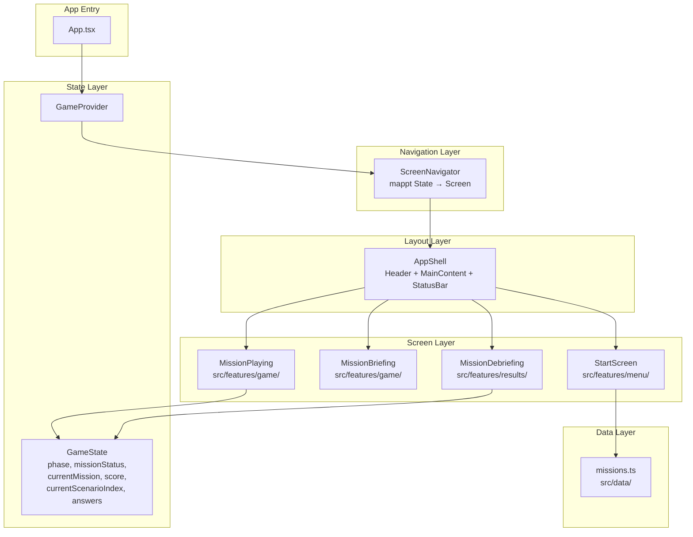
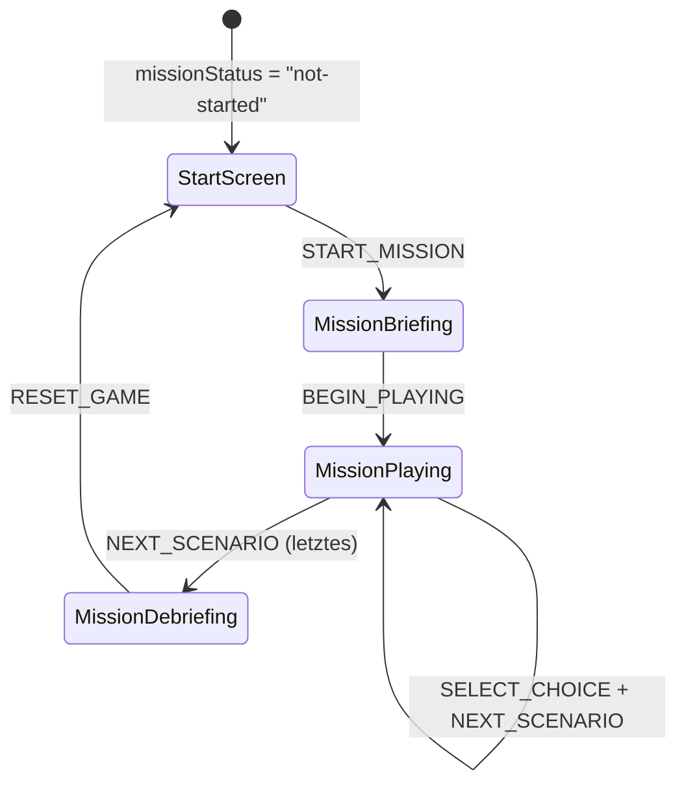
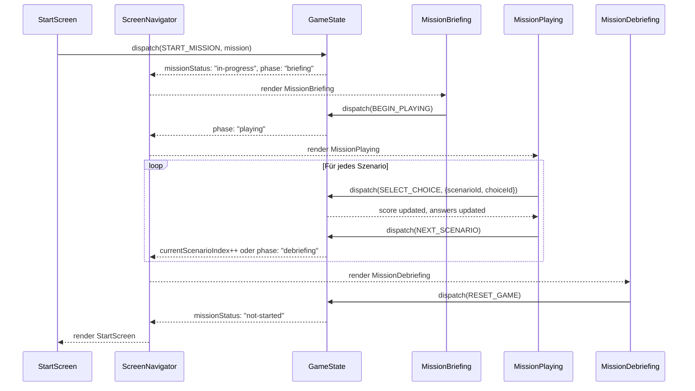

# Design Document: Mission Navigation

## Overview

Dieses Dokument beschreibt die technische Architektur für das Screen-Navigations- und Missionsablaufsystem. Das System steuert den gesamten Spielfluss: StartScreen → MissionBriefing → MissionPlaying → MissionDebriefing → zurück zum Start.

Die zentrale Design-Entscheidung ist der Verzicht auf URL-basiertes Routing (react-router). Statt dessen wird der angezeigte Screen **deterministisch** aus dem GameState abgeleitet. Ein `ScreenNavigator`-Komponente dient als reine Mapping-Funktion: `(missionStatus, phase) → Screen`.

### Design-Entscheidungen

| Entscheidung | Gewählt | Begründung |
|---|---|---|
| Routing-Ansatz | State-basiert via GameState | Kein react-router nötig, ein State-Wert = ein Screen, einfachste Lösung für MVP |
| ScreenNavigator-Pattern | Switch/Map über (missionStatus, phase) | Deterministisch, keine interne State-Logik, pure Ableitung |
| Mock-Daten | Statische Konstante in `src/data/` | Data-driven Missions, einfach austauschbar |
| Feedback-Darstellung | Inline nach Choice-Selection | Kein Modal, kein separater Screen, direktes Feedback im Kontext |
| Visual Style Briefing | "CLASSIFIED" Dossier-Card | Agenten-Theme konsistent mit Design System |
| StatusBar-Integration | Bedingt via showStatusBar-Prop | Nur während Playing-Phase sichtbar |

## Architecture

### Architektur-Übersicht



### Screen-Routing-Logik



### Datei-Struktur

```
src/
├── data/
│   └── missions.ts                # Mock-Missionsdaten
├── features/
│   ├── menu/
│   │   └── StartScreen.tsx        # Missionsauswahl + Fortschritt
│   ├── game/
│   │   ├── MissionBriefing.tsx    # Agenten-Dossier Briefing
│   │   ├── MissionPlaying.tsx     # Szenario + Choices + Feedback
│   │   └── ScreenNavigator.tsx    # State → Screen Mapping
│   └── results/
│       └── MissionDebriefing.tsx   # Score + Zusammenfassung
```

## Components and Interfaces

### 1. ScreenNavigator (`src/features/game/ScreenNavigator.tsx`)

Zentrale Navigationskomponente — mappt GameState auf den aktuell sichtbaren Screen.

```typescript
import { useGameState } from '../../hooks/use-game-state';
import { AppShell } from '../../components/AppShell';
import StartScreen from '../menu/StartScreen';
import MissionBriefing from './MissionBriefing';
import MissionPlaying from './MissionPlaying';
import MissionDebriefing from '../results/MissionDebriefing';

/**
 * Leitet den aktuell anzuzeigenden Screen deterministisch
 * aus dem GameState ab. Keine eigene State-Verwaltung.
 */
export function ScreenNavigator() {
  const { state } = useGameState();
  const { missionStatus, phase, currentMission, currentScenarioIndex } = state;

  // StatusBar nur während Playing-Phase
  const showStatusBar = phase === 'playing';
  const totalScenarios = currentMission?.scenarios.length ?? 0;
  const progressPercent = totalScenarios > 0
    ? (currentScenarioIndex / totalScenarios) * 100
    : 0;
  const progressLabel = showStatusBar
    ? `Szenario ${currentScenarioIndex + 1} von ${totalScenarios}`
    : undefined;

  // Deterministic screen selection
  const renderScreen = () => {
    if (missionStatus === 'not-started') {
      return <StartScreen />;
    }
    if (missionStatus === 'in-progress' && phase === 'briefing') {
      return <MissionBriefing />;
    }
    if (missionStatus === 'in-progress' && phase === 'playing') {
      return <MissionPlaying />;
    }
    if (missionStatus === 'completed' && phase === 'debriefing') {
      return <MissionDebriefing />;
    }
    // Fallback — sollte mit korrektem State nie eintreten
    return <StartScreen />;
  };

  return (
    <AppShell
      showStatusBar={showStatusBar}
      statusBarProps={{
        progress: progressPercent,
        label: progressLabel,
      }}
    >
      {renderScreen()}
    </AppShell>
  );
}
```

**Mapping-Tabelle:**

| missionStatus | phase | Angezeigter Screen | StatusBar |
|---|---|---|---|
| `not-started` | * | StartScreen | hidden |
| `in-progress` | `briefing` | MissionBriefing | hidden |
| `in-progress` | `playing` | MissionPlaying | visible + progress |
| `completed` | `debriefing` | MissionDebriefing | hidden |

### 2. StartScreen (`src/features/menu/StartScreen.tsx`)

```typescript
export interface StartScreenProps {}

/**
 * Zeigt verfügbare Missionen, Spielerfortschritt und ermöglicht Missionsstart.
 * Liest Missionsliste aus statischen Daten, Fortschritt aus GameState/PlayerProgress.
 */
export function StartScreen() {
  const { state, dispatch } = useGameState();
  // PlayerProgress aus localStorage oder Context
  // Missionsliste aus src/data/missions.ts

  return (
    <div className="space-y-6">
      {/* Spieler-Statistik */}
      <div className="flex items-center justify-between">
        <p className="text-text-secondary text-sm">
          Abgeschlossene Missionen: {completedCount}
        </p>
        <p className="text-accent-primary font-medium">
          Score: {totalScore}
        </p>
      </div>

      {/* Missionsliste */}
      {missions.map((mission) => (
        <Card
          key={mission.id}
          elevation="md"
          className="cursor-pointer hover:shadow-lg transition-shadow duration-fast"
          onClick={() => dispatch({ type: 'START_MISSION', payload: mission })}
        >
          <div className="flex items-center justify-between">
            <div>
              <h2 className="text-text-primary font-semibold">{mission.title}</h2>
              <p className="text-text-secondary text-sm mt-1">{mission.description}</p>
            </div>
            {isCompleted(mission.id) && (
              <Badge variant="success">Abgeschlossen</Badge>
            )}
          </div>
        </Card>
      ))}
    </div>
  );
}
```

### 3. MissionBriefing (`src/features/game/MissionBriefing.tsx`)

```typescript
export interface MissionBriefingProps {}

/**
 * Zeigt ein "CLASSIFIED" Agenten-Dossier mit Missionsinformationen.
 * Button zum Starten der Playing-Phase.
 */
export function MissionBriefing() {
  const { state, dispatch } = useGameState();
  const mission = state.currentMission;

  if (!mission) return null;

  return (
    <div className="space-y-6">
      <Card elevation="lg" className="border border-accent-primary/20">
        {/* Classified Header */}
        <div className="text-center mb-4">
          <span className="text-xs tracking-[0.3em] text-danger font-bold uppercase">
            CLASSIFIED
          </span>
          <div className="h-px bg-accent-primary/20 mt-2" />
        </div>

        {/* Mission Details */}
        <h1 className="text-xl font-bold text-text-primary mb-3">
          {mission.title}
        </h1>
        <p className="text-text-secondary leading-relaxed mb-4">
          {mission.description}
        </p>

        {/* Meta-Info */}
        <div className="flex items-center gap-2 text-sm text-text-secondary">
          <Badge variant="info">{mission.scenarios.length} Szenarien</Badge>
        </div>
      </Card>

      <Button
        variant="primary"
        size="lg"
        className="w-full"
        onClick={() => dispatch({ type: 'BEGIN_PLAYING' })}
      >
        Mission beginnen
      </Button>
    </div>
  );
}
```

### 4. MissionPlaying (`src/features/game/MissionPlaying.tsx`)

```typescript
export interface MissionPlayingProps {}

/**
 * Zeigt aktuelles Szenario mit Kontext, Choices und Feedback.
 * Verwaltet lokalen UI-State für "selectedChoice" (welche Choice gewählt wurde).
 */
export function MissionPlaying() {
  const { state, dispatch } = useGameState();
  const [selectedChoiceId, setSelectedChoiceId] = useState<string | null>(null);

  const mission = state.currentMission;
  if (!mission) return null;

  const scenario = mission.scenarios[state.currentScenarioIndex];
  if (!scenario) return null;

  const selectedChoice = scenario.choices.find(c => c.id === selectedChoiceId);

  const handleSelectChoice = (choiceId: string) => {
    if (selectedChoiceId) return; // Bereits gewählt
    setSelectedChoiceId(choiceId);
    dispatch({
      type: 'SELECT_CHOICE',
      payload: { scenarioId: scenario.id, choiceId },
    });
  };

  const handleNext = () => {
    setSelectedChoiceId(null);
    dispatch({ type: 'NEXT_SCENARIO' });
  };

  return (
    <div className="space-y-6">
      {/* Fortschrittsanzeige */}
      <p className="text-sm text-text-secondary text-center">
        Szenario {state.currentScenarioIndex + 1} von {mission.scenarios.length}
      </p>

      {/* Szenario-Kontext */}
      <Card elevation="md">
        <p className="text-text-primary leading-relaxed">{scenario.context}</p>
      </Card>

      {/* Choices */}
      <div className="space-y-3">
        {scenario.choices.map((choice) => (
          <button
            key={choice.id}
            type="button"
            disabled={!!selectedChoiceId}
            onClick={() => handleSelectChoice(choice.id)}
            className={`w-full text-left p-4 rounded-lg border transition-colors duration-fast
              ${selectedChoiceId === choice.id
                ? choice.isCorrect
                  ? 'border-accent-secondary bg-accent-secondary/10'
                  : 'border-danger bg-danger/10'
                : selectedChoiceId
                  ? 'opacity-50 cursor-not-allowed border-bg-tertiary'
                  : 'border-bg-tertiary hover:border-accent-primary/50 bg-bg-secondary'
              }`}
          >
            <span className="text-text-primary">{choice.text}</span>
          </button>
        ))}
      </div>

      {/* Feedback */}
      {selectedChoice && (
        <Card
          elevation="sm"
          className={`border ${
            selectedChoice.isCorrect
              ? 'border-accent-secondary/50 bg-accent-secondary/5'
              : 'border-warning/50 bg-warning/5'
          }`}
        >
          <p className="text-text-primary text-sm">{selectedChoice.feedback}</p>
        </Card>
      )}

      {/* Weiter-Button */}
      {selectedChoiceId && (
        <Button variant="primary" className="w-full" onClick={handleNext}>
          Weiter
        </Button>
      )}
    </div>
  );
}
```

### 5. MissionDebriefing (`src/features/results/MissionDebriefing.tsx`)

```typescript
export interface MissionDebriefingProps {}

/**
 * Zeigt Ergebnis-Zusammenfassung: Score, per-Scenario Correct/Incorrect, Achievements.
 */
export function MissionDebriefing() {
  const { state, dispatch } = useGameState();
  const mission = state.currentMission;

  if (!mission) return null;

  const maxScore = mission.scenarios.reduce((sum, s) => {
    const correctChoice = s.choices.find(c => c.isCorrect);
    return sum + (correctChoice?.points ?? 0);
  }, 0);

  return (
    <div className="space-y-6">
      {/* Score-Übersicht */}
      <Card elevation="lg" className="text-center">
        <h1 className="text-2xl font-bold text-text-primary mb-2">Mission abgeschlossen</h1>
        <p className="text-3xl font-bold text-accent-primary">
          {state.score} / {maxScore}
        </p>
        <p className="text-text-secondary text-sm mt-1">Punkte erreicht</p>
      </Card>

      {/* Szenario-Zusammenfassung */}
      <div className="space-y-2">
        <h2 className="text-text-primary font-semibold">Zusammenfassung</h2>
        {mission.scenarios.map((scenario, index) => {
          const answer = state.answers.find(a => a.scenarioId === scenario.id);
          const isCorrect = answer?.choiceId === scenario.correctChoiceId;

          return (
            <div key={scenario.id} className="flex items-center justify-between p-3 bg-bg-secondary rounded-lg">
              <span className="text-text-primary text-sm">
                Szenario {index + 1}
              </span>
              <Badge variant={isCorrect ? 'success' : 'danger'}>
                {isCorrect ? 'Richtig' : 'Falsch'}
              </Badge>
            </div>
          );
        })}
      </div>

      {/* Zurück-Button */}
      <Button
        variant="primary"
        className="w-full"
        onClick={() => dispatch({ type: 'RESET_GAME' })}
      >
        Zurück zum Start
      </Button>
    </div>
  );
}
```

### 6. App Integration

```typescript
// App.tsx — Neuer Aufbau mit GameProvider + ScreenNavigator
import { GameProvider } from './hooks/use-game-state';
import { ScreenNavigator } from './features/game/ScreenNavigator';

function App() {
  return (
    <GameProvider>
      <ScreenNavigator />
    </GameProvider>
  );
}

export default App;
```

## Data Models

### Mock Mission Data (`src/data/missions.ts`)

Eine Phishing-Mission mit 3 Szenarien für Entwicklung und Testing:

```typescript
import type { Mission } from '../types/game.types';

export const MISSIONS: readonly Mission[] = [
  {
    id: 'phishing-01',
    title: 'Operation: Phishing-Alarm',
    description: 'Ein verdächtiger E-Mail-Angriff wurde gemeldet. Analysiere die Situation und triff die richtigen Entscheidungen, um den Angriff abzuwehren.',
    category: 'phishing',
    scenarios: [
      {
        id: 'phishing-01-s1',
        context: 'Du erhältst eine E-Mail mit dem Betreff "Dringende Passwort-Änderung erforderlich" von "it-support@firna.de" (Tippfehler in der Domain). Die E-Mail enthält einen Link zur angeblichen Passwort-Änderungsseite.',
        correctChoiceId: 'phishing-01-s1-c2',
        choices: [
          {
            id: 'phishing-01-s1-c1',
            text: 'Auf den Link klicken und das Passwort ändern — es könnte wichtig sein.',
            points: 0,
            feedback: 'Vorsicht! Die Domain "firna.de" enthält einen Tippfehler. Legitime IT-Abteilungen nutzen immer die korrekte Firmendomain. Niemals Links in verdächtigen E-Mails anklicken.',
            isCorrect: false,
          },
          {
            id: 'phishing-01-s1-c2',
            text: 'Die E-Mail als verdächtig melden und die IT-Abteilung direkt kontaktieren.',
            points: 10,
            feedback: 'Richtig! Die falsche Domain "firna.de" ist ein klares Warnsignal. Die IT-Abteilung zu kontaktieren ist der sicherste Weg.',
            isCorrect: true,
          },
          {
            id: 'phishing-01-s1-c3',
            text: 'Die E-Mail ignorieren und löschen.',
            points: 5,
            feedback: 'Löschen ist besser als Klicken, aber das Melden an die IT-Abteilung hilft, andere Kollegen zu warnen.',
            isCorrect: false,
          },
        ],
      },
      {
        id: 'phishing-01-s2',
        context: 'Dein Vorgesetzter schickt dir per WhatsApp eine Nachricht: "Kannst du schnell eine Überweisung von 5.000€ an diesen Lieferanten machen? Bin gerade im Meeting, kann nicht telefonieren. Hier die IBAN: DE89..."',
        correctChoiceId: 'phishing-01-s2-c3',
        choices: [
          {
            id: 'phishing-01-s2-c1',
            text: 'Die Überweisung sofort durchführen — der Chef hat es eilig.',
            points: 0,
            feedback: 'Stopp! Dies ist ein klassischer CEO-Fraud. Finanzielle Anweisungen über Messenger ohne Verifizierung sollten nie befolgt werden.',
            isCorrect: false,
          },
          {
            id: 'phishing-01-s2-c2',
            text: 'Per WhatsApp zurückfragen, ob es wirklich von ihm kommt.',
            points: 3,
            feedback: 'Der Kanal selbst könnte kompromittiert sein. Besser ist es, über einen separaten Kommunikationsweg (z.B. Anruf) zu verifizieren.',
            isCorrect: false,
          },
          {
            id: 'phishing-01-s2-c3',
            text: 'Den Vorgesetzten über einen anderen Kanal (Telefon, persönlich) kontaktieren zur Verifizierung.',
            points: 10,
            feedback: 'Perfekt! Bei unerwarteten finanziellen Anfragen immer über einen separaten Kanal verifizieren. Das ist die beste Abwehr gegen CEO-Fraud.',
            isCorrect: true,
          },
        ],
      },
      {
        id: 'phishing-01-s3',
        context: 'Du findest einen USB-Stick auf dem Parkplatz vor dem Bürogebäude. Er ist mit "Gehaltsliste Q4" beschriftet.',
        correctChoiceId: 'phishing-01-s3-c2',
        choices: [
          {
            id: 'phishing-01-s3-c1',
            text: 'Den USB-Stick an deinem Arbeitsrechner anschließen, um den Besitzer zu identifizieren.',
            points: 0,
            feedback: 'Niemals unbekannte USB-Sticks anschließen! Dies ist eine bekannte Angriffsmethode ("USB-Dropping"). Der Stick könnte Malware enthalten.',
            isCorrect: false,
          },
          {
            id: 'phishing-01-s3-c2',
            text: 'Den USB-Stick bei der IT-Abteilung abgeben ohne ihn anzuschließen.',
            points: 10,
            feedback: 'Genau richtig! Die IT-Abteilung kann den Stick sicher überprüfen. USB-Dropping ist eine verbreitete Social-Engineering-Technik.',
            isCorrect: true,
          },
          {
            id: 'phishing-01-s3-c3',
            text: 'Den USB-Stick liegen lassen — ist nicht dein Problem.',
            points: 3,
            feedback: 'Besser als anschließen, aber jemand anderes könnte ihn finden und einstecken. Am besten der IT-Abteilung übergeben.',
            isCorrect: false,
          },
        ],
      },
    ],
  },
] as const;
```

### Datenfluss durch die Screens



### Zustandsinvarianten für Navigation

| Invariante | Beschreibung |
|---|---|
| Determinismus | Gleicher GameState → immer gleicher Screen |
| Vollständigkeit | Jede valide (missionStatus, phase) Kombination hat einen zugeordneten Screen |
| Kein eigener State | ScreenNavigator hat keine useState-Aufrufe für Navigation |
| StatusBar-Kopplung | `showStatusBar === (phase === 'playing')` |
| Progress-Berechnung | `progress = (currentScenarioIndex / scenarios.length) * 100` |


## Correctness Properties

*A property is a characteristic or behavior that should hold true across all valid executions of a system — essentially, a formal statement about what the system should do. Properties serve as the bridge between human-readable specifications and machine-verifiable correctness guarantees.*

### Property 1: Screen-State Deterministic Mapping

*For any* valid GameState with a (missionStatus, phase) tuple, the ScreenNavigator SHALL render exactly the screen determined by:
- ("not-started", *) → StartScreen
- ("in-progress", "briefing") → MissionBriefing
- ("in-progress", "playing") → MissionPlaying
- ("completed", "debriefing") → MissionDebriefing

The same state SHALL always produce the same screen, with no internal navigation state influencing the result.

**Validates: Requirements 1.1, 1.2, 1.3, 1.4, 1.5**

### Property 2: StatusBar Visibility Tied to Playing Phase

*For any* valid GameState, the ScreenNavigator SHALL pass `showStatusBar = true` to AppShell if and only if `phase === "playing"`. For all other phase values, `showStatusBar` SHALL be false.

**Validates: Requirements 1.7, 7.1, 7.4**

### Property 3: Progress Percentage Calculation

*For any* mission with N scenarios (N > 0) and any valid currentScenarioIndex I (0 ≤ I ≤ N), the progress percentage passed to the StatusBar SHALL equal `(I / N) * 100`.

**Validates: Requirements 4.5, 7.2**

### Property 4: Progress Label Format

*For any* mission with N scenarios and any valid currentScenarioIndex I, the progress label SHALL be exactly the string `"Szenario ${I + 1} von ${N}"`.

**Validates: Requirements 4.4, 7.3**

### Property 5: StartScreen Renders All Missions

*For any* non-empty array of missions, the StartScreen SHALL render an element displaying the title and description of each mission in the array.

**Validates: Requirements 2.1**

### Property 6: Completed Mission Badge Matches Progress

*For any* mission whose id appears in the PlayerProgress completedMissions list, the StartScreen SHALL render a Badge with "success" variant for that mission. For any mission not in the completedMissions list, no completion Badge SHALL be rendered.

**Validates: Requirements 2.5**

### Property 7: MissionBriefing Displays Mission Data

*For any* Mission object with title T, description D, and N scenarios, the MissionBriefing screen SHALL render T in a heading element, D as paragraph text, and the number N within the component.

**Validates: Requirements 3.1, 3.2, 3.3**

### Property 8: MissionPlaying Renders Current Scenario Choices

*For any* scenario with K choices (K ≥ 2), the MissionPlaying screen SHALL render exactly K interactive elements, each displaying the corresponding choice's text content.

**Validates: Requirements 4.1, 4.2, 4.3**

### Property 9: Feedback Styling Matches Correctness

*For any* selected choice, the feedback area's visual styling SHALL use accent-secondary (success) color classes when `choice.isCorrect === true`, and warning/danger color classes when `choice.isCorrect === false`.

**Validates: Requirements 5.3, 5.4**

### Property 10: Debriefing Per-Scenario Badge Matches Correctness

*For any* completed mission with N scenarios and N answers, each scenario's summary entry SHALL display a Badge with variant "success" if the player's answer matches the scenario's correctChoiceId, and variant "danger" otherwise.

**Validates: Requirements 6.2, 6.3, 6.4**

## Error Handling

### ScreenNavigator Fehlerbehandlung

| Situation | Verhalten | Begründung |
|---|---|---|
| Ungültige State-Kombination | Fallback auf StartScreen | Defensive Programmierung, kein Crash |
| currentMission ist null während briefing/playing | Screen rendert `null` (leerer Inhalt) | Sollte nicht auftreten, Guards als Absicherung |
| currentScenarioIndex out of bounds | MissionPlaying rendert `null` | Guard-Check vor Zugriff auf scenarios[index] |

### Screen-Komponenten Fehlerbehandlung

| Situation | Verhalten | Begründung |
|---|---|---|
| Leere Missionsliste | StartScreen zeigt leeren Zustand | Kein Crash, UI bleibt funktional |
| Mission ohne Szenarien | MissionBriefing zeigt "0 Szenarien", Button bleibt klickbar | Edge Case, nicht kritisch für MVP |
| Choice ohne feedback-Text | Leerer Feedback-Bereich wird angezeigt | Graceful degradation |
| answers-Array kürzer als scenarios | Fehlende Antworten werden als "nicht beantwortet" behandelt | Debriefing bleibt funktional |

### UI-State Fehlerbehandlung (MissionPlaying)

| Situation | Verhalten | Begründung |
|---|---|---|
| Doppelklick auf Choice | Zweiter Klick wird ignoriert (Guard: `if (selectedChoiceId) return`) | Verhindert doppelte Dispatch-Aufrufe |
| selectedChoiceId reset bei NEXT_SCENARIO | `setSelectedChoiceId(null)` vor dispatch | Sauberer Zustand für nächstes Szenario |
| Schnelles Navigieren | React State-Batch verhindert inkonsistente Renderings | Standard React 19 Verhalten |

## Testing Strategy

### Test-Tooling

- **Vitest** als Test-Runner
- **React Testing Library** (@testing-library/react) für Komponentenrendering
- **@testing-library/jest-dom** für DOM-Assertions
- **fast-check** für Property-Based Tests

### Warum Property-Based Testing hier passt

Die ScreenNavigator-Komponente ist eine **deterministische Mapping-Funktion**: GameState-Input → Screen-Output. Der Input-Space (Kombinationen von missionStatus, phase, scenarioIndex, mission data) ist gut generierbar. Die Progress-Berechnung und Label-Formatierung sind pure Funktionen mit numerischem Input. Die Screen-Rendering-Properties (alle Choices rendern, Badge-Variante matches Korrektheit) profitieren von randomisierten Eingabedaten.

### Test-Struktur

```
src/
├── features/
│   ├── game/
│   │   └── __tests__/
│   │       ├── ScreenNavigator.test.tsx        # Properties 1, 2, 3, 4
│   │       ├── MissionBriefing.test.tsx         # Property 7 + Unit Tests
│   │       └── MissionPlaying.test.tsx          # Properties 8, 9 + Unit Tests
│   ├── menu/
│   │   └── __tests__/
│   │       └── StartScreen.test.tsx            # Properties 5, 6 + Unit Tests
│   └── results/
│       └── __tests__/
│           └── MissionDebriefing.test.tsx       # Property 10 + Unit Tests
```

### Property-Based Tests (fast-check, min. 100 Iterationen)

**Generatoren:**

```typescript
// Generiert zufällige valide GameStates für Navigation-Tests
const arbitraryGameStateForNav = (): fc.Arbitrary<GameState> =>
  fc.oneof(
    // not-started state
    fc.constant(DEFAULT_GAME_STATE),
    // in-progress briefing
    arbitraryMission().map(m => ({
      currentMission: m,
      currentScenarioIndex: 0,
      score: 0,
      answers: [],
      phase: 'briefing' as const,
      missionStatus: 'in-progress' as const,
    })),
    // in-progress playing (random scenario index)
    arbitraryMission().chain(m =>
      fc.nat({ max: m.scenarios.length - 1 }).map(idx => ({
        currentMission: m,
        currentScenarioIndex: idx,
        score: fc.nat().generate(fc.random(0), undefined).value,
        answers: [],
        phase: 'playing' as const,
        missionStatus: 'in-progress' as const,
      }))
    ),
    // completed debriefing
    arbitraryMission().map(m => ({
      currentMission: m,
      currentScenarioIndex: m.scenarios.length,
      score: 25,
      answers: m.scenarios.map(s => ({ scenarioId: s.id, choiceId: s.choices[0].id })),
      phase: 'debriefing' as const,
      missionStatus: 'completed' as const,
    }))
  );

// Generiert zufällige Missionen mit 2-5 Szenarien
const arbitraryMission = (): fc.Arbitrary<Mission> =>
  fc.record({
    id: fc.string({ minLength: 1, maxLength: 20 }),
    title: fc.string({ minLength: 1, maxLength: 50 }),
    description: fc.string({ minLength: 1, maxLength: 200 }),
    category: fc.constantFrom('phishing', 'social-engineering', 'passwords'),
    scenarios: fc.array(arbitraryScenario(), { minLength: 2, maxLength: 5 }),
  });
```

**Beispiel Property-Test:**

```typescript
// Feature: mission-navigation, Property 1: Screen-State Deterministic Mapping
it('renders the correct screen for any valid GameState', () => {
  fc.assert(
    fc.property(arbitraryGameStateForNav(), (gameState) => {
      const { getByTestId } = renderWithProvider(gameState);

      if (gameState.missionStatus === 'not-started') {
        expect(getByTestId('start-screen')).toBeInTheDocument();
      } else if (gameState.missionStatus === 'in-progress' && gameState.phase === 'briefing') {
        expect(getByTestId('mission-briefing')).toBeInTheDocument();
      } else if (gameState.missionStatus === 'in-progress' && gameState.phase === 'playing') {
        expect(getByTestId('mission-playing')).toBeInTheDocument();
      } else if (gameState.missionStatus === 'completed' && gameState.phase === 'debriefing') {
        expect(getByTestId('mission-debriefing')).toBeInTheDocument();
      }
    }),
    { numRuns: 100 }
  );
});
```

### Unit-Tests (Beispiel-basiert)

Ergänzend zu den Property-Tests:

| Komponente | Unit Test Fokus |
|---|---|
| ScreenNavigator | Fallback-Verhalten, AppShell-Rendering |
| StartScreen | Klick auf Mission-Card dispatcht START_MISSION |
| MissionBriefing | "CLASSIFIED" Text vorhanden, Button dispatcht BEGIN_PLAYING |
| MissionPlaying | Choice-Klick dispatcht SELECT_CHOICE, "Weiter" dispatcht NEXT_SCENARIO, Choices nach Auswahl disabled |
| MissionDebriefing | Score-Anzeige korrekt, "Zurück zum Start" dispatcht RESET_GAME |

### Tags für Property Tests

Format: **Feature: mission-navigation, Property {number}: {title}**

- Feature: mission-navigation, Property 1: Screen-State Deterministic Mapping
- Feature: mission-navigation, Property 2: StatusBar Visibility Tied to Playing Phase
- Feature: mission-navigation, Property 3: Progress Percentage Calculation
- Feature: mission-navigation, Property 4: Progress Label Format
- Feature: mission-navigation, Property 5: StartScreen Renders All Missions
- Feature: mission-navigation, Property 6: Completed Mission Badge Matches Progress
- Feature: mission-navigation, Property 7: MissionBriefing Displays Mission Data
- Feature: mission-navigation, Property 8: MissionPlaying Renders Current Scenario Choices
- Feature: mission-navigation, Property 9: Feedback Styling Matches Correctness
- Feature: mission-navigation, Property 10: Debriefing Per-Scenario Badge Matches Correctness
