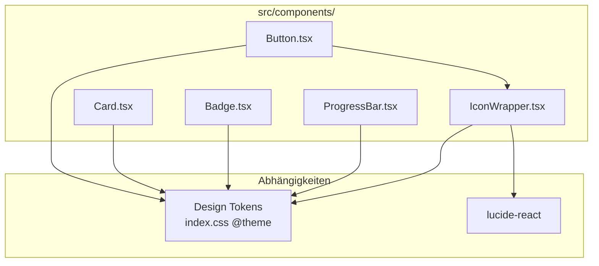

# Design Document: UI Components

## Overview

Dieses Design beschreibt die Implementierung von fünf wiederverwendbaren Basis-UI-Komponenten für die gamifizierte IT-Security Awareness Anwendung: **Button**, **Card**, **Badge**, **ProgressBar** und **IconWrapper**.

Die Komponenten bauen auf dem bestehenden Design System (Tailwind CSS v4, CSS Custom Properties, Dark Cyber/Agent Theme) auf und nutzen ausschließlich Tailwind Utility Classes für das Styling. Jede Komponente ist ein eigenständiges React Functional Component mit typisierten Props.

### Design-Entscheidungen

| Entscheidung | Gewählt | Begründung |
|---|---|---|
| Styling-Ansatz | Tailwind Utility Classes direkt | Kein CSS-in-JS, keine separate CSS-Dateien, konsistent mit Design System |
| Icon-Library | lucide-react | Bereits als Projekt-Standard definiert, Tree-Shakeable |
| Varianten-Steuerung | String-Literal Props + bedingte Klassen | Einfach, typsicher, kein zusätzliches Library (z.B. cva) nötig |
| Composability | children + className Props | React-Standard-Pattern, maximale Flexibilität |
| Dateistruktur | Ein File pro Komponente in src/components/ | Übersichtlich, einfach importierbar |
| Export-Stil | Named + Default Export | Default für Komponente, Named für Props-Interface |

## Architecture

### Komponentenstruktur



### Dateistruktur

```
src/components/
├── Button.tsx         # Button mit Varianten, Größen, Loading/Icon
├── Card.tsx           # Container mit Elevation
├── Badge.tsx          # Inline Status-Label
├── ProgressBar.tsx    # Fortschrittsbalken
├── IconWrapper.tsx    # Konsistenter Icon-Wrapper
└── Layout.tsx         # Bestehend (unverändert)
```

### Abhängigkeits-Hierarchie

- **IconWrapper** → keine Komponenten-Abhängigkeit (nur lucide-react)
- **Button** → nutzt optional IconWrapper für icon-Prop
- **Card, Badge, ProgressBar** → keine Abhängigkeiten zu anderen Basis-Komponenten
- Alle Komponenten → nutzen Design Tokens via Tailwind Utility Classes

### Design Token Nutzung

Die Komponenten referenzieren folgende Token-Gruppen über Tailwind Utilities:

| Token-Gruppe | Tailwind Utility Pattern | Verwendung |
|---|---|---|
| Farben (bg) | `bg-bg-secondary`, `bg-bg-tertiary` | Card-Hintergrund, ProgressBar-Track |
| Farben (accent) | `bg-accent-primary`, `bg-accent-secondary` | Button primary, ProgressBar fill, Badge |
| Farben (status) | `bg-warning`, `bg-danger` | Badge Varianten |
| Farben (text) | `text-text-primary`, `text-text-secondary` | Button-Text, Badge-Text |
| Schatten | `shadow-sm`, `shadow-md`, `shadow-lg` | Card Elevation |
| Border-Radius | `rounded-md`, `rounded-lg`, `rounded-full` | Button, Card, Badge, ProgressBar |
| Animationen | `duration-fast`, `duration-normal` | Button Hover, ProgressBar Transition |

## Components and Interfaces

### 1. Button Component

```typescript
import type { ReactNode, ButtonHTMLAttributes } from 'react';
import type { LucideIcon } from 'lucide-react';

export interface ButtonProps extends Omit<ButtonHTMLAttributes<HTMLButtonElement>, 'disabled'> {
  /** Visuelle Variante */
  variant?: 'primary' | 'secondary' | 'ghost';
  /** Größe */
  size?: 'sm' | 'md' | 'lg';
  /** Ladezustand — zeigt Spinner, deaktiviert Interaktion */
  loading?: boolean;
  /** Deaktiviert den Button */
  disabled?: boolean;
  /** Optionales Icon (lucide-react Icon-Komponente) */
  icon?: LucideIcon;
  /** Button-Inhalt */
  children: ReactNode;
}
```

**Implementierungsansatz:**

```tsx
function Button({
  variant = 'primary',
  size = 'md',
  loading = false,
  disabled = false,
  icon: Icon,
  children,
  className,
  ...rest
}: ButtonProps) {
  const isDisabled = disabled || loading;

  const baseClasses = 'inline-flex items-center justify-center gap-2 font-medium rounded-md transition-colors duration-fast focus-visible:outline-2 focus-visible:outline-offset-2 focus-visible:outline-accent-primary';

  const variantClasses = {
    primary: 'bg-accent-primary text-bg-primary hover:bg-accent-primary/80',
    secondary: 'bg-transparent border border-accent-primary text-accent-primary hover:bg-accent-primary/10',
    ghost: 'bg-transparent text-text-secondary hover:text-text-primary hover:bg-bg-tertiary',
  };

  const sizeClasses = {
    sm: 'px-3 py-1 text-sm',
    md: 'px-4 py-2 text-base',
    lg: 'px-6 py-3 text-lg',
  };

  const disabledClasses = isDisabled ? 'opacity-50 pointer-events-none' : '';

  return (
    <button
      className={`${baseClasses} ${variantClasses[variant]} ${sizeClasses[size]} ${disabledClasses} ${className ?? ''}`}
      disabled={isDisabled}
      aria-busy={loading}
      {...rest}
    >
      {loading ? <LoadingSpinner /> : Icon ? <Icon size={size === 'sm' ? 16 : size === 'lg' ? 24 : 20} aria-hidden="true" /> : null}
      {children}
    </button>
  );
}
```

**Loading Spinner:** Ein einfacher animierter SVG-Kreis oder ein CSS-animiertes `<span>` mit `animate-spin`.

### 2. Card Component

```typescript
import type { ReactNode, HTMLAttributes } from 'react';

export interface CardProps extends HTMLAttributes<HTMLDivElement> {
  /** Schattentiefe */
  elevation?: 'sm' | 'md' | 'lg';
  /** Zusätzliche CSS-Klassen */
  className?: string;
  /** Inhalt */
  children: ReactNode;
}
```

**Implementierungsansatz:**

```tsx
function Card({
  elevation = 'md',
  className,
  children,
  ...rest
}: CardProps) {
  const elevationClasses = {
    sm: 'shadow-sm',
    md: 'shadow-md',
    lg: 'shadow-lg',
  };

  return (
    <div
      className={`bg-bg-secondary rounded-lg p-4 ${elevationClasses[elevation]} ${className ?? ''}`}
      {...rest}
    >
      {children}
    </div>
  );
}
```

### 3. Badge Component

```typescript
import type { ReactNode } from 'react';

export interface BadgeProps {
  /** Farbvariante */
  variant?: 'success' | 'warning' | 'danger' | 'info' | 'neutral';
  /** Label-Text */
  children: ReactNode;
}
```

**Implementierungsansatz:**

```tsx
function Badge({ variant = 'neutral', children }: BadgeProps) {
  const variantClasses = {
    success: 'bg-accent-secondary/20 text-accent-secondary',
    warning: 'bg-warning/20 text-warning',
    danger: 'bg-danger/20 text-danger',
    info: 'bg-accent-primary/20 text-accent-primary',
    neutral: 'bg-bg-tertiary text-text-secondary',
  };

  return (
    <span className={`inline-block rounded-full px-2 py-0.5 text-xs font-medium ${variantClasses[variant]}`}>
      {children}
    </span>
  );
}
```

### 4. ProgressBar Component

```typescript
export interface ProgressBarProps {
  /** Fortschrittswert 0–100 */
  value: number;
  /** Füllfarbe (Tailwind bg-Klasse) */
  color?: string;
  /** Balkenhöhe */
  size?: 'sm' | 'md' | 'lg';
  /** Zusätzliche CSS-Klassen */
  className?: string;
}
```

**Implementierungsansatz:**

```tsx
function ProgressBar({
  value,
  color = 'bg-accent-primary',
  size = 'md',
  className,
}: ProgressBarProps) {
  const clampedValue = Math.max(0, Math.min(100, value));

  const sizeClasses = {
    sm: 'h-1',    // 4px
    md: 'h-2',    // 8px
    lg: 'h-3',    // 12px
  };

  return (
    <div
      role="progressbar"
      aria-valuenow={clampedValue}
      aria-valuemin={0}
      aria-valuemax={100}
      className={`w-full bg-bg-tertiary rounded-full overflow-hidden ${sizeClasses[size]} ${className ?? ''}`}
    >
      <div
        className={`h-full rounded-full transition-[width] duration-normal ${color}`}
        style={{ width: `${clampedValue}%` }}
      />
    </div>
  );
}
```

### 5. IconWrapper Component

```typescript
import type { LucideIcon } from 'lucide-react';

export interface IconWrapperProps {
  /** lucide-react Icon-Komponente */
  icon: LucideIcon;
  /** Größe in px */
  size?: 'sm' | 'md' | 'lg';
  /** Farbe (CSS color string oder Tailwind text-* Klasse) */
  color?: string;
  /** Wenn gesetzt: Icon ist informativ (role="img" + aria-label) */
  ariaLabel?: string;
  /** Zusätzliche CSS-Klassen */
  className?: string;
}
```

**Implementierungsansatz:**

```tsx
function IconWrapper({
  icon: Icon,
  size = 'md',
  color,
  ariaLabel,
  className,
}: IconWrapperProps) {
  const sizeMap = { sm: 16, md: 20, lg: 24 };
  const pixelSize = sizeMap[size];

  if (ariaLabel) {
    return (
      <span role="img" aria-label={ariaLabel} className={className}>
        <Icon size={pixelSize} color={color ?? 'currentColor'} aria-hidden="true" />
      </span>
    );
  }

  return (
    <Icon
      size={pixelSize}
      color={color ?? 'currentColor'}
      aria-hidden="true"
      className={className}
    />
  );
}
```

## Data Models

### Props-Zusammenfassung

| Komponente | Pflicht-Props | Optionale Props | Defaults |
|---|---|---|---|
| Button | `children` | `variant`, `size`, `loading`, `disabled`, `icon`, `className` | variant: 'primary', size: 'md' |
| Card | `children` | `elevation`, `className` | elevation: 'md' |
| Badge | `children` | `variant` | variant: 'neutral' |
| ProgressBar | `value` | `color`, `size`, `className` | color: 'bg-accent-primary', size: 'md' |
| IconWrapper | `icon` | `size`, `color`, `ariaLabel`, `className` | size: 'md', color: 'currentColor' |

### Varianten-Mapping

```typescript
// Button Varianten → Tailwind-Klassen
type ButtonVariantMap = Record<'primary' | 'secondary' | 'ghost', string>;

// Badge Varianten → Tailwind-Klassen (Hintergrund + Text)
type BadgeVariantMap = Record<'success' | 'warning' | 'danger' | 'info' | 'neutral', string>;

// Elevations → Shadow-Token-Klassen
type ElevationMap = Record<'sm' | 'md' | 'lg', string>;

// Sizes → Dimension-Klassen
type SizeMap = Record<'sm' | 'md' | 'lg', string | number>;
```

### Icon-Integration

lucide-react Icons werden als Komponenten-Referenz übergeben (nicht als JSX):

```typescript
import { Shield, Lock, AlertTriangle } from 'lucide-react';

// Verwendung:
<Button icon={Shield}>Sichern</Button>
<IconWrapper icon={Lock} size="lg" ariaLabel="Gesperrt" />
```


## Correctness Properties

*A property is a characteristic or behavior that should hold true across all valid executions of a system — essentially, a formal statement about what the system should do. Properties serve as the bridge between human-readable specifications and machine-verifiable correctness guarantees.*

### Property 1: Button-Variante bestimmt korrekte Styling-Klassen

*For any* valid Button variant value ("primary", "secondary", "ghost"), rendering a Button with that variant SHALL produce a DOM element containing exactly the expected Tailwind utility classes for that variant's background, border, and text color — and no classes belonging to a different variant.

**Validates: Requirements 1.2, 1.3, 1.4**

### Property 2: Button-Größe bestimmt korrekte Padding- und Font-Klassen

*For any* valid Button size value ("sm", "md", "lg"), rendering a Button with that size SHALL produce a DOM element containing the expected padding classes and font-size class corresponding to that size.

**Validates: Requirements 1.5, 1.6, 1.7**

### Property 3: Card-Elevation bestimmt korrekten Schatten

*For any* valid Card elevation value ("sm", "md", "lg"), rendering a Card with that elevation SHALL produce a DOM element containing the shadow class `shadow-{elevation}` and no other shadow-level classes.

**Validates: Requirements 2.2, 2.3, 2.4**

### Property 4: Badge-Variante bestimmt korrekte Farb-Klassen

*For any* valid Badge variant value ("success", "warning", "danger", "info", "neutral"), rendering a Badge with that variant SHALL produce a DOM element containing the expected background and text color classes for that variant.

**Validates: Requirements 3.2, 3.3, 3.4, 3.5, 3.6**

### Property 5: ProgressBar-Wert wird korrekt auf 0–100% geklemmt

*For any* numeric value (including negative numbers, zero, values between 0–100, and values exceeding 100), the ProgressBar fill element's width style SHALL equal `clamp(0, value, 100)%` AND the aria-valuenow attribute SHALL equal the same clamped integer value.

**Validates: Requirements 4.2, 4.3, 4.7**

### Property 6: ProgressBar-Größe bestimmt korrekte Höhe

*For any* valid ProgressBar size value ("sm", "md", "lg"), rendering a ProgressBar with that size SHALL produce a container element with the height class corresponding to 4px, 8px, or 12px respectively.

**Validates: Requirements 4.8, 4.9, 4.10**

### Property 7: IconWrapper-Größe bestimmt korrektes Pixel-Maß

*For any* valid IconWrapper size value ("sm", "md", "lg"), rendering an IconWrapper with that size SHALL pass the corresponding pixel dimension (16, 20, or 24) to the underlying lucide-react icon component.

**Validates: Requirements 5.2, 5.3, 5.4**

## Error Handling

### Props-Validierung (Runtime)

| Komponente | Fehlerfall | Verhalten |
|---|---|---|
| ProgressBar | `value` < 0 oder > 100 | Wird auf 0–100 geklemmt, kein Error |
| ProgressBar | `value` ist NaN | Fallback auf 0 |
| Button | `loading` + `disabled` gleichzeitig | `loading` hat Vorrang (Spinner wird angezeigt) |
| IconWrapper | `icon` ist undefined | TypeScript verhindert dies zur Compile-Zeit |
| Card | `elevation` ungültig | TypeScript verhindert dies zur Compile-Zeit |

### Fehlerhafte className-Props

Alle Komponenten, die `className` akzeptieren, verwenden einfache String-Konkatenation. Ungültige Klassen werden vom Browser ignoriert (keine Exceptions). Leere Strings oder `undefined` erzeugen keine sichtbaren Probleme.

### Fehlende Design Tokens

Wenn ein referenziertes Design Token (z.B. `--color-accent-primary`) nicht in `index.css` definiert ist, wird die Tailwind-Klasse nicht generiert. Dies führt zu fehlendem Styling, aber nicht zu einem Laufzeitfehler. Das Build-System (Tailwind) gibt keine Warnung aus — dies wird durch Code-Review und Integration Tests abgedeckt.

### Browser-Kompatibilität

- `focus-visible` wird von allen modernen Browsern unterstützt (Chrome 86+, Firefox 85+, Safari 15.4+)
- CSS `clamp()` wird nicht verwendet (Clamping geschieht in JavaScript)
- `aria-valuenow` als number ist universell unterstützt

## Testing Strategy

### Test-Tooling

- **Vitest** als Test-Runner (bereits im Vite-Ökosystem)
- **React Testing Library** (@testing-library/react) für Komponentenrendering
- **@testing-library/jest-dom** für erweiterte DOM-Assertions
- **fast-check** für Property-Based Tests

### Warum Property-Based Testing hier passt

Die Komponenten haben klare Input-Output-Beziehungen: Props (Variante, Größe, Wert) → DOM-Output (CSS-Klassen, Attribute, Styles). Die Varianten-/Größen-Mappings sind reine Funktionen mit begrenztem, aber gut definierbarem Input-Space. Besonders die ProgressBar mit ihrem numerischen `value`-Prop profitiert von PBT, da der Input-Space kontinuierlich ist (jede Zahl ist möglich).

### Test-Struktur

```
src/components/
├── __tests__/
│   ├── Button.test.tsx          # Unit + Property Tests
│   ├── Card.test.tsx            # Unit Tests
│   ├── Badge.test.tsx           # Unit + Property Tests
│   ├── ProgressBar.test.tsx     # Unit + Property Tests
│   └── IconWrapper.test.tsx     # Unit + Property Tests
```

### Property-Based Tests (fast-check, min. 100 Iterationen)

Jeder Property-Test referenziert die Design-Property:

```typescript
// Feature: ui-components, Property 5: ProgressBar value clamping
fc.assert(
  fc.property(fc.double({ min: -1000, max: 1000, noNaN: true }), (value) => {
    const { container } = render(<ProgressBar value={value} />);
    const fill = container.querySelector('[role="progressbar"] > div');
    const clamped = Math.max(0, Math.min(100, value));
    expect(fill).toHaveStyle({ width: `${clamped}%` });
  }),
  { numRuns: 100 }
);
```

### Unit-Tests (Beispiel-basiert)

Unit Tests decken ab:
- Default-Werte (elevation default zu "md", size default zu "md")
- Boolean-States (loading, disabled)
- Conditional Rendering (Icon vorhanden/nicht vorhanden)
- ARIA-Attribute (role, aria-hidden, aria-label)
- Children-Rendering
- className Pass-Through

### Test-Konfiguration

```typescript
// vite.config.ts (Erweiterung)
/// <reference types="vitest" />
export default defineConfig({
  test: {
    globals: true,
    environment: 'jsdom',
    setupFiles: ['./src/test-setup.ts'],
  },
});
```

### Zusätzliche Dev-Dependencies

| Package | Zweck |
|---|---|
| `vitest` | Test-Runner |
| `@testing-library/react` | React-Komponenten Rendering in Tests |
| `@testing-library/jest-dom` | DOM-Assertions (toHaveClass, toHaveAttribute) |
| `jsdom` | DOM-Environment für Vitest |
| `fast-check` | Property-Based Testing Library |
| `lucide-react` | Icon-Library (Prod-Dependency) |

### Tags für Property Tests

Format: **Feature: ui-components, Property {number}: {title}**

- Feature: ui-components, Property 1: Button variant class mapping
- Feature: ui-components, Property 2: Button size class mapping
- Feature: ui-components, Property 3: Card elevation shadow mapping
- Feature: ui-components, Property 4: Badge variant color mapping
- Feature: ui-components, Property 5: ProgressBar value clamping
- Feature: ui-components, Property 6: ProgressBar size height mapping
- Feature: ui-components, Property 7: IconWrapper size pixel mapping
